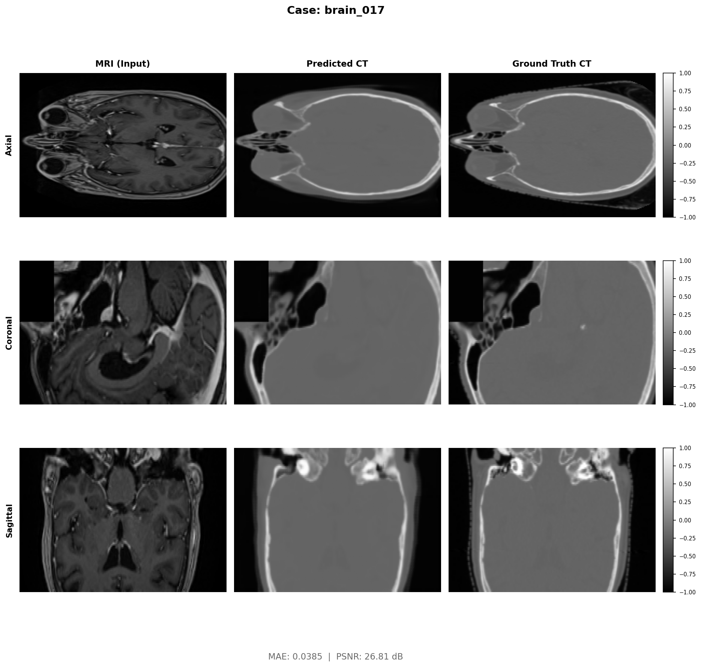
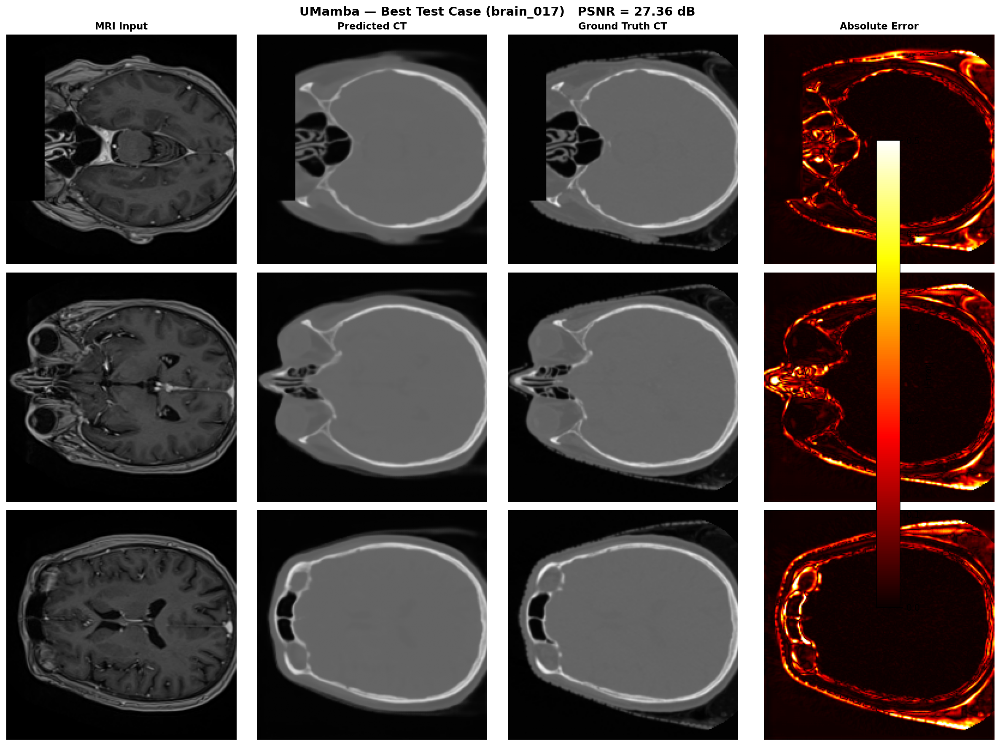
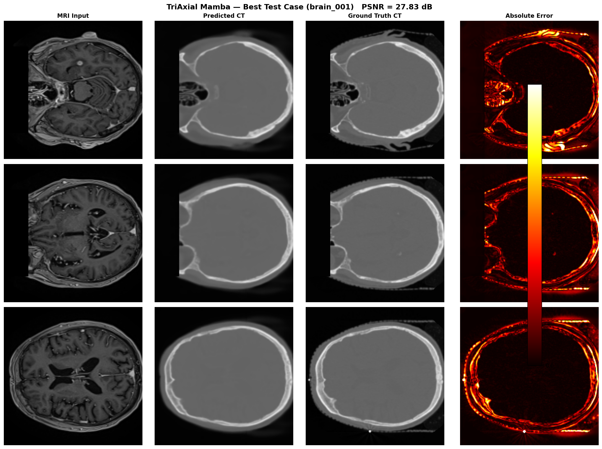
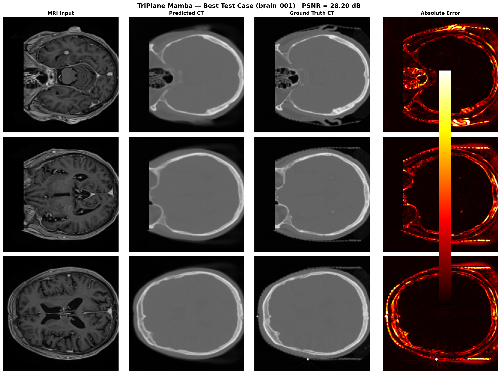
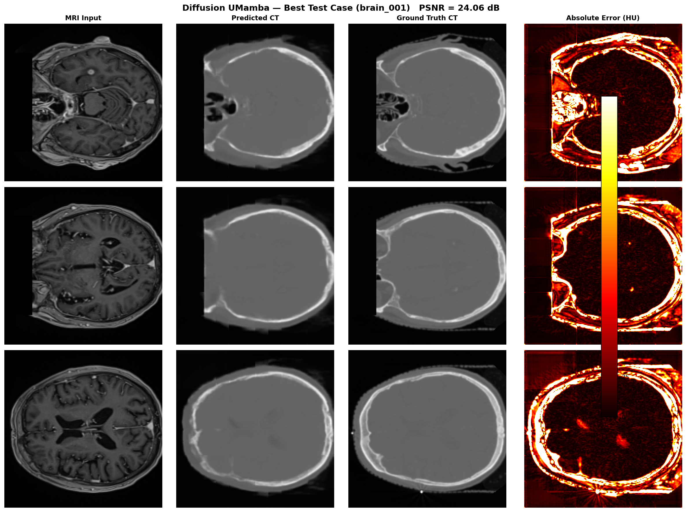

# MRI-to-Synthetic-CT Synthesis — Research Repository

This repository contains **six deep-learning architectures** for **3D MRI → Synthetic CT synthesis** targeting MRI-only radiotherapy planning. Four Mamba-based regression models, one pretrained-encoder diffusion model, and one Diffusion UMamba model are implemented and evaluated.

---

## Table of Contents

- [Overview](#overview)
- [Repository Structure](#repository-structure)
- [Approaches](#approaches)
  - [SegMamba](#1-segmamba)
  - [U-Mamba](#2-u-mamba)
  - [TriAxial Mamba](#3-triaxial-mamba-trimamba-unet-v2)
  - [TriPlane Mamba](#4-triplane-mamba-triplanemamba-unet)
  - [Pretrained Encoder + Hybrid Diffusion](#5-pretrained-encoder--hybrid-diffusion)
  - [Diffusion UMamba](#6-diffusion-umamba)
- [Dataset](#dataset)
- [Results Summary](#results-summary)
- [Dosimetric Analysis](#dosimetric-analysis)
- [Environment Setup](#environment-setup)

---

## Overview

Synthetic CT (sCT) generation from MRI avoids the need for a separate CT scan in radiation treatment planning. This repository benchmarks:

1. **SegMamba** — Hybrid CNN + Mamba U-Net
2. **U-Mamba** — U-Net with Mamba SSM encoder blocks
3. **TriAxial Mamba** — 3D U-Net with per-axis bidirectional Mamba scans
4. **TriPlane Mamba** — 3D U-Net with 2D planar Mamba scans + multi-scale depth convolutions
5. **Pretrained Encoder + Hybrid Diffusion** — Task-aware MRI semantic encoder (Stage 1) + frozen-encoder cross-attention diffusion (Stage 2)
6. **Diffusion UMamba** — Conditional DDPM with UMamba as the noise-prediction backbone (replaces SwinViT)

All models are trained on brain MRI / CT pairs and evaluated with MAE, PSNR, SSIM, and clinical dosimetric metrics (tissue MAE, RED, Gamma-Index).

---

## Repository Structure

```
/DATA/divyansh/
│
├── README.md                                          ← you are here
│
├── mamba_approach/                                    ← all Mamba-based architectures
│   ├── README.md                                      # Mamba approach overview + comparison table
│   │
│   ├── models.py                                      # SegMamba + UMamba definitions (shared)
│   ├── train.py                                       # Shared training script
│   ├── evaluate.py                                    # Shared evaluation script
│   ├── dataset.py                                     # Brain NPY data loader
│   ├── losses.py                                      # wMAE + SSIM + AFP loss
│   ├── visualize.py                                   # Comparison PNG generation
│   ├── dosometric.py                                  # RED / Gamma dosimetric analysis
│   ├── dosimetric_analysis.md                         # SegMamba vs UMamba dosimetric report
│   ├── architecture.html                              # Interactive architecture diagram
│   │
│   ├── SegMamba/                                      # SegMamba model + results
│   │   ├── README.md
│   │   ├── run_training.sh / run_eval.sh / run_viz.sh
│   │   ├── training_output.log
│   │   ├── segmamba_report.md
│   │   ├── checkpoints/
│   │   │   ├── segmamba_best.pth
│   │   │   ├── segmamba_epoch*.pth  (50 → 500)
│   │   │   └── visuals/             (500 epoch dashboards)
│   │   ├── predictions/             (37 test .npy files)
│   │   └── visualizations/          (37 MRI|PredCT|RealCT PNGs)
│   │
│   ├── UMamba/                                        # U-Mamba model + results
│   │   ├── README.md
│   │   ├── run_training.sh / run_eval.sh / run_viz.sh
│   │   ├── training_output.log
│   │   ├── umamba_report.md / unet_umamba_report.md
│   │   ├── diffusion_mamba_models.py
│   │   ├── main_diffusionUmamba.py
│   │   ├── checkpoints/
│   │   │   ├── umamba_best.pth
│   │   │   ├── umamba_epoch*.pth  (50 → 500)
│   │   │   └── visuals/           (500 epoch dashboards)
│   │   └── predictions/           (37 test .npy files)
│   │
│   ├── triaxial_mamba/                                # TriAxial Mamba model + results
│   │   ├── README.md
│   │   ├── Triaxial_Mamba_Report.md
│   │   ├── models.py / train.py / evaluate.py / evaluate_dosimetric.py
│   │   ├── dataset.py / losses.py / visualize.py
│   │   ├── environment.yml
│   │   ├── run_training_trimamba.sh / resume_training_trimamba.sh
│   │   ├── run_eval_trimamba.sh
│   │   ├── training_trimamba_output.log
│   │   ├── checkpoints_trimamba/
│   │   │   ├── trimamba_best.pth
│   │   │   ├── trimamba_epoch*.pth
│   │   │   └── visuals/           (epoch dashboards)
│   │   └── predictions_trimamba/
│   │       ├── dosimetric_metrics.csv
│   │       └── brain_*.npy
│   │
│   └── triplane_mamba/                                # TriPlane Mamba model + results
│       ├── README.md
│       ├── Triplane_Mamba_Report.md
│       ├── models.py / train.py / evaluate.py / evaluate_dosimetric.py
│       ├── dataset.py / losses.py / visualize.py
│       ├── environment.yml
│       ├── run_training_triplane.sh / resume_training_triplane.sh
│       ├── run_eval_trimamba.sh
│       ├── training_triplane_output.log
│       ├── checkpoints_triplane/
│       │   ├── triplane_best.pth
│       │   ├── triplane_epoch*.pth
│       │   └── visuals/           (epoch dashboards)
│       └── predictions_triplane/
│           ├── dosimetric_metrics.csv
│           └── brain_*.npy
│
├── diffusion_umamba/                                  ← Conditional DDPM with UMamba backbone
│   ├── README.md
│   ├── Diffusion_umamba_report.md
│   ├── models.py / main_umamba_diffusion.py / test_umamba_diffusion.py
│   ├── evaluate_dosimetry.py / run_*.sh
│   ├── network/                                       # Denoising network architectures
│   ├── diffusion/                                     # DDPM process
│   ├── checkpoints/  best_model.pt / latest_model.pt
│   ├── visualizations/  epoch_*_comparison.png + training_metrics.png
│   └── inference_results/  dosimetric_metrics_all.csv + dosimetric_test_metrics.csv
│
├── pretrained_encoder_diffusion/                      ← 2-stage pretrained encoder + diffusion
│   │                                                  # Stage 1: MRI semantic encoder pretraining
│   │                                                  # Stage 2: Frozen encoder + hybrid diffusion
│   ├── README.md
│   ├── network/                                       # Model architectures
│   │   ├── mri_encoder.py                             # MRI semantic encoder (Stage 1 core)
│   │   ├── hybrid_model.py                            # Hybrid encoder+diffusion model
│   │   ├── cross_attention.py                         # CrossAttention3D
│   │   └── Diffusion_model_*.py / SwinUnetr.py …
│   ├── diffusion/                                     # DDPM / hybrid diffusion processes
│   ├── stage1_encoder/                                # Stage 1: encoder pretraining
│   │   ├── pretrain_mri_encoder.py / eval_mri_encoder.py / run_pretrain.sh
│   │   ├── checkpoints/  best_mri_encoder.pt
│   │   ├── visualizations/  epoch_NNNN.png
│   │   ├── eval_results/
│   │   └── tensorboard_logs/
│   ├── stage2_diffusion/                              # Stage 2: hybrid diffusion training
│   │   ├── main_hybrid.py / inference_hybrid.py / run_training_hybrid.sh …
│   │   ├── checkpoints/  best_model.pt
│   │   ├── results/  brain_hybrid/ / final/
│   │   └── inference_results/hybrid/  metrics.txt + vis/
│   ├── baseline/                                      # Original MC-IDDPM (no encoder)
│   │   ├── main.py / main_no_tensorboard.py / run_training.sh
│   ├── scripts/                                       # Utility scripts
│   │   ├── run_preprocessing.py / analyze_task1_data.py / evaluate_final.py …
│   ├── notebooks/
│   │   └── MC-IDDPM main.ipynb
│   └── data/  MRI_to_CT_brain_for_dosimetric/
│
├── mc_ddpm_data/                                      ← processed dataset (NPY + NIfTI)
│   ├── brain/                                         # Brain MRI / CT pairs (NIfTI)
│   │   ├── imagesTr/ / imagesTs/ / imagesVal/
│   │   └── labelsTr/ / labelsTs/ / labelsVal/
│   ├── brain_npy/                                     # Brain pairs (NumPy, pre-normalized)
│   │   ├── imagesTr/ / imagesTs/ / imagesVal/
│   │   └── labelsTr/ / labelsTs/ / labelsVal/
│   ├── pelvis/                                        # Pelvis MRI / CT pairs (NIfTI)
│   └── pelvis_npy/                                    # Pelvis pairs (NumPy)
│
└── Task1/                                             ← raw patient data
    ├── brain/                                         # Patient folders (1BA001, …)
    │   └── <patient>/  ct.nii.gz  mr.nii.gz  mask.nii.gz
    └── pelvis/                                        # Pelvis patient folders
```

---

## Approaches

### 1. SegMamba

> **[mamba_approach/SegMamba/](mamba_approach/SegMamba/)**

Hybrid CNN + Mamba U-Net. Each block = residual CNN + Mamba SSM scan over flattened 3D tokens. Standard skip connections. Adam · LR 5×10⁻⁴ cosine annealed · 500 epochs.

**Best test case — brain_017 (PSNR 26.81 dB) · MRI Input · Predicted CT · Ground Truth CT · Absolute Error:**



| Metric | Score | Std Dev |
|---|---|---|
| MAE | 0.0480 | ± 0.0079 |
| PSNR | 24.79 dB | ± 1.19 dB |
| SSIM | 0.8432 | ± 0.0369 |

> All 37 test comparisons: [mamba_approach/SegMamba/visualizations/](mamba_approach/SegMamba/visualizations/)

---

### 2. U-Mamba

> **[mamba_approach/UMamba/](mamba_approach/UMamba/)**

U-Net with Mamba SSM encoder blocks. Full 3D volume flattened to 1D sequence — linear-time global context. Batch size 1 (memory-constrained). Adam · LR 5×10⁻⁴ cosine annealed · 500 epochs.

**Best test case — brain_017 (PSNR 27.36 dB) · MRI Input · Predicted CT · Ground Truth CT · Absolute Error:**



| Metric | Score | Std Dev |
|---|---|---|
| MAE | 0.0443 | ± 0.0075 |
| PSNR | 25.23 dB | ± 1.30 dB |
| SSIM | 0.8531 | ± 0.0358 |

---

### 3. TriAxial Mamba (TriMamba-UNet V2)

> **[mamba_approach/triaxial_mamba/](mamba_approach/triaxial_mamba/)**

Bidirectional Mamba scans along **D, H, W axes separately** — no full-volume flattening. CBAM3D attention on skip connections, deep supervision, gradient checkpointing. Adam · LR 5×10⁻⁴ cosine annealed · 500 epochs.

**Best test case — brain_001 (PSNR 27.83 dB) · MRI Input · Predicted CT · Ground Truth CT · Absolute Error:**



| Metric | Score | Std Dev |
|---|---|---|
| MAE | 0.0458 | ± 0.0070 |
| PSNR | 25.71 dB | ± 1.31 dB |
| SSIM | 0.8540 | ± 0.0341 |

---

### 4. TriPlane Mamba (TriPlaneMamba-UNet)

> **[mamba_approach/triplane_mamba/](mamba_approach/triplane_mamba/)**

**Best performing architecture.** 2D planar Mamba scans across Axial (HW), Coronal (DW), Sagittal (DH) planes + parallel MultiScaleDepthConv branch (dilations 1, 2, 4, 8). CBAM3D on skips, deep supervision. Adam · LR 5×10⁻⁴ cosine annealed · 500 epochs.

**Best test case — brain_001 (PSNR 28.20 dB) · MRI Input · Predicted CT · Ground Truth CT · Absolute Error:**



| Metric | Score | Std Dev |
|---|---|---|
| **MAE** | **0.0445** | ± 0.0074 |
| **PSNR** | **25.79 dB** | ± 1.42 dB |
| **SSIM** | **0.8561** | ± 0.0358 |

---

### 5. Pretrained Encoder + Hybrid Diffusion

> **[pretrained_encoder_diffusion/](pretrained_encoder_diffusion/)**

**2-stage pipeline** separating MRI semantic learning from diffusion denoising. Stage 1: MRI encoder pretrained via dual-task (MRI recon + CT prediction). Stage 2: frozen encoder conditions the DDPM denoiser via CrossAttention3D. Adam · LR 1×10⁻⁴ cosine annealed · both stages.

**Best test case — Sample 0 (PSNR 26.12 dB, SSIM 0.8386) · MRI | GT CT | Synthetic CT | Error:**


| Metric | Score |
|---|---|
| PSNR | 24.12 dB |
| SSIM | 0.8037 |
| MAE | 0.0492 |

> Full inference gallery: [pretrained_encoder_diffusion/stage2_diffusion/inference_results/hybrid/vis/](pretrained_encoder_diffusion/stage2_diffusion/inference_results/hybrid/vis/)

---

### 6. Diffusion UMamba

> **[diffusion_umamba/](diffusion_umamba/)**

Conditional **DDPM** with a **UMamba backbone** as the noise predictor. Takes a 2-channel input (MRI + noisy CT) and outputs ε + learned variance. Timestep sinusoidal embeddings are injected into every UMambaBlock via FiLM conditioning. Adam · LR 3×10⁻⁵ · 1000 diffusion steps · 500 epochs.

**Best test case — brain_001 (PSNR 24.06 dB) · MRI Input · Predicted CT · Ground Truth CT · Absolute Error:**



| Metric | Score |
|---|---|
| PSNR (3D) | 22.49 dB ± 0.82 dB |
| SSIM | 0.7678 ± 0.0318 |
| Gamma (1% / 1mm) | **90.52%** |
| Gamma (2% / 2mm) | 99.03% |

> Despite lower PSNR vs Mamba regression models, Diffusion UMamba crosses the clinical **90% Gamma threshold** — suggesting the diffusion process preserves dose-relevant structure even when pixel-level HU accuracy is weaker.

---

## Dataset

### `mc_ddpm_data/` — Pre-processed Training Data

| Split | Modalities | Format | Shape |
|---|---|---|---|
| Train (`Tr`) | MRI + CT | `.npy` and `.nii.gz` | `(2, 192, 192, 96)` |
| Validation (`Val`) | MRI + CT | `.npy` and `.nii.gz` | — |
| Test (`Ts`) | MRI + CT | `.npy` and `.nii.gz` | — |

Both **brain** and **pelvis** regions are available.

Data normalization: MRI and CT values are pre-scaled to **[-1, 1]**.

### `Task1/` — Raw Patient Data (NIfTI)

Individual patient folders, each containing `ct.nii.gz`, `mr.nii.gz`, `mask.nii.gz`.

---

## Results Summary

### Image Quality Metrics

| Architecture | MAE ↓ | PSNR ↑ | SSIM ↑ |
|---|---|---|---|
| SegMamba | 0.0480 ± 0.0079 | 24.79 dB | 0.8432 |
| U-Mamba | 0.0443 ± 0.0075 | 25.23 dB | 0.8531 |
| TriAxial Mamba | 0.0458 ± 0.0070 | 25.71 dB | 0.8540 |
| **TriPlane Mamba** | **0.0445 ± 0.0074** | **25.79 dB** | **0.8561** |
| Pretrained Enc. + Diffusion | 0.0492 ± 0.0077 | 24.12 dB | 0.8037 |
| Diffusion UMamba | — | 22.49 dB ± 0.82 | 0.7678 ± 0.0318 |

### Dosimetric Summary (Gamma-Index)

| Architecture | Gamma (1%/1mm) ↑ | Gamma (2%/2mm) ↑ |
|---|---|---|
| SegMamba | 91.61% | 99.35% |
| **U-Mamba** | **93.26%** | **99.55%** |
| TriAxial Mamba | 88.71% | 98.83% |
| TriPlane Mamba | 90.61% ✓ | 99.14% |
| Diffusion UMamba | 90.52% ✓ | 99.03% |

> ✓ = crosses the clinical 90% threshold for the strict 1%/1mm Gamma criterion.

---

## Dosimetric Analysis

Full dosimetric comparison (tissue MAE, RED, Gamma-Index) across all approaches:

> See [Dosimetric_Analysis_Report_Mamba.md](Dosimetric_Analysis_Report_Mamba.md) for the complete report.

### TriAxial vs TriPlane Mamba

| Metric | TriAxial | TriPlane | Best |
|---|---|---|---|
| PSNR (3D) | 25.71 dB | **25.79 dB** | TriPlane |
| SSIM | 0.8483 | **0.8502** | TriPlane |
| Air MAE | 60.77 HU | **57.36 HU** | TriPlane |
| Soft Tissue MAE | **38.31 HU** | 38.87 HU | TriAxial |
| Bone MAE | 196.20 HU | **189.39 HU** | TriPlane |
| RED MAE | 0.05012 | **0.04837** | TriPlane |
| Gamma (1% / 1mm) | 88.71% | **90.61%** | TriPlane |
| Gamma (2% / 2mm) | 98.83% | **99.14%** | TriPlane |

### SegMamba vs U-Mamba

| Metric | SegMamba | U-Mamba | Best |
|---|---|---|---|
| PSNR (3D) | 24.79 dB | **25.23 dB** | U-Mamba |
| Bone MAE | 208.52 HU | **192.50 HU** | U-Mamba |
| RED MAE | 0.05208 | **0.04794** | U-Mamba |
| Gamma (1% / 1mm) | 91.61% | **93.26%** | U-Mamba |
| Gamma (2% / 2mm) | 99.35% | **99.55%** | U-Mamba |

**Key takeaway:** TriPlane Mamba is clinically the strongest performer, crossing the **90% threshold for the strict 1%/1mm Gamma criterion** (90.61%), and achieves the best Bone MAE (189.39 HU) and RED MAE (0.04837).

---

## Environment Setup

### Mamba variants (SegMamba, UMamba)

```bash
conda create -n mamba_ct python=3.10 -y
conda activate mamba_ct
pip install torch torchvision --index-url https://download.pytorch.org/whl/cu118
pip install numpy scipy scikit-image monai
pip install causal-conv1d>=1.2.0 mamba-ssm
```

### TriAxial / TriPlane Mamba

```bash
conda env create -f mamba_approach/triaxial_mamba/environment.yml
# or
conda env create -f mamba_approach/triplane_mamba/environment.yml
```

> If `mamba-ssm` fails to install (CUDA mismatch), the code automatically falls back to a GRU-based SSM block.

---

## Quick Links

| What | Where |
|---|---|
| SegMamba weights | [mamba_approach/SegMamba/checkpoints/segmamba_best.pth](mamba_approach/SegMamba/checkpoints/segmamba_best.pth) |
| UMamba weights | [mamba_approach/UMamba/checkpoints/umamba_best.pth](mamba_approach/UMamba/checkpoints/umamba_best.pth) |
| TriAxial weights | [mamba_approach/triaxial_mamba/checkpoints_trimamba/trimamba_best.pth](mamba_approach/triaxial_mamba/checkpoints_trimamba/trimamba_best.pth) |
| TriPlane weights | [mamba_approach/triplane_mamba/checkpoints_triplane/triplane_best.pth](mamba_approach/triplane_mamba/checkpoints_triplane/triplane_best.pth) |
| Mamba overview README | [mamba_approach/README.md](mamba_approach/README.md) |
| TriAxial full report | [mamba_approach/triaxial_mamba/Triaxial_Mamba_Report.md](mamba_approach/triaxial_mamba/Triaxial_Mamba_Report.md) |
| TriPlane full report | [mamba_approach/triplane_mamba/Triplane_Mamba_Report.md](mamba_approach/triplane_mamba/Triplane_Mamba_Report.md) |
| Dosimetric report | [Dosimetric_Analysis_Report_Mamba.md](Dosimetric_Analysis_Report_Mamba.md) |
| Encoder+Diffusion README | [pretrained_encoder_diffusion/README.md](pretrained_encoder_diffusion/README.md) |
| Encoder pretraining script | [pretrained_encoder_diffusion/stage1_encoder/pretrain_mri_encoder.py](pretrained_encoder_diffusion/stage1_encoder/pretrain_mri_encoder.py) |
| Hybrid diffusion training | [pretrained_encoder_diffusion/stage2_diffusion/main_hybrid.py](pretrained_encoder_diffusion/stage2_diffusion/main_hybrid.py) |
| Hybrid model test metrics | [pretrained_encoder_diffusion/stage2_diffusion/inference_results/hybrid/metrics.txt](pretrained_encoder_diffusion/stage2_diffusion/inference_results/hybrid/metrics.txt) |
| Diffusion UMamba README | [diffusion_umamba/README.md](diffusion_umamba/README.md) |
| Diffusion UMamba training | [diffusion_umamba/main_umamba_diffusion.py](diffusion_umamba/main_umamba_diffusion.py) |
| Diffusion UMamba dosimetric CSV | [diffusion_umamba/inference_results/dosimetric_metrics_all.csv](diffusion_umamba/inference_results/dosimetric_metrics_all.csv) |
| Diffusion UMamba report | [diffusion_umamba/Diffusion_umamba_report.md](diffusion_umamba/Diffusion_umamba_report.md) |
