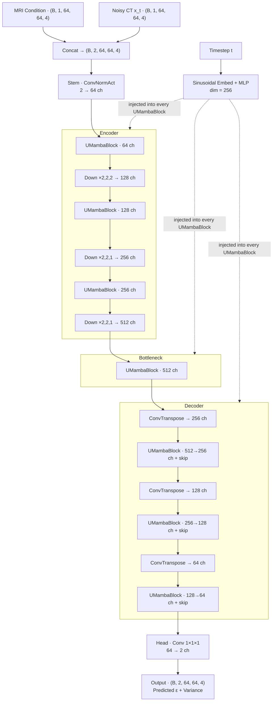
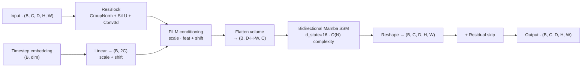
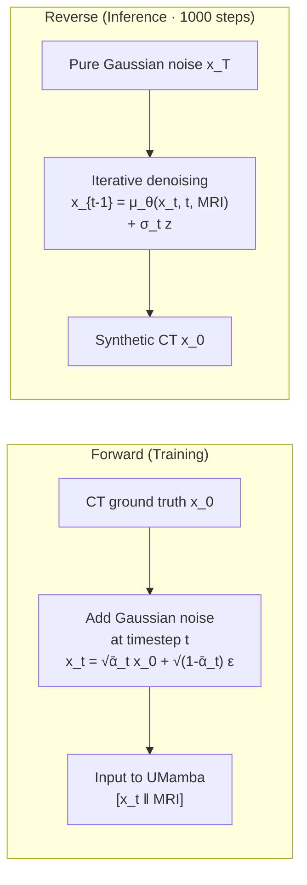
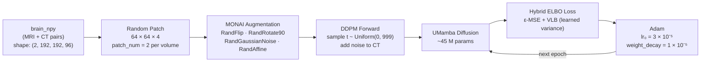
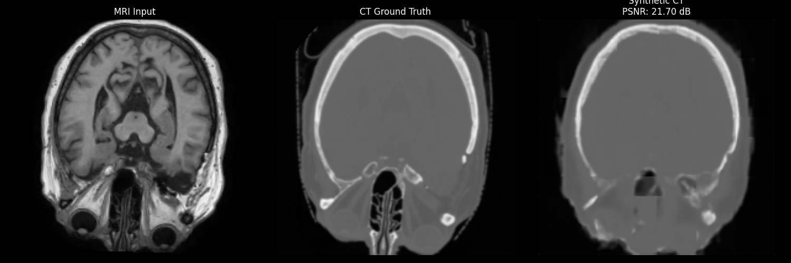
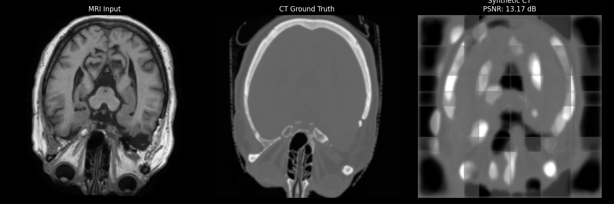

# Diffusion UMamba — MRI-to-CT Synthesis

A conditional **Denoising Diffusion Probabilistic Model (DDPM)** for MRI → Synthetic CT generation, using a **3D UMamba backbone** as the noise-prediction network. This replaces the standard Swin Transformer denoiser with Mamba State Space Models, achieving linear O(N) complexity for 3D volumetric data.

---

## Folder Structure

```
diffusion_umamba/
├── README.md
├── Diffusion_umamba_report.md     # Full technical report
├── models.py                      # UMamba model definition
├── main_umamba_diffusion.py       # Training entry point
├── test_umamba_diffusion.py       # Inference + test evaluation
├── evaluate_dosimetry.py          # Dosimetric analysis (RED, Gamma)
├── run_umamba_diffusion.sh        # Training launch script
├── run_test_umamba_diffusion.sh   # Test / inference script
├── run_manual_pipeline.sh         # Step-by-step manual pipeline
├── training_log.txt               # Full training log (500 epochs)
├── test_umamba.log                # Inference / test log
│
├── network/                       # Denoising network architectures
│   ├── Diffusion_model_mamba.py   # Mamba-based diffusion denoiser
│   ├── Diffusion_model_transformer.py
│   ├── Diffusion_model_Unet.py
│   ├── SwinUnetr.py
│   ├── nnFormer.py
│   └── util_network.py
│
├── diffusion/                     # DDPM process
│   ├── Create_diffusion.py        # Factory: build GaussianDiffusion
│   ├── GaussianDiffusion.py       # Core DDPM forward/reverse process
│   ├── normal_diffusion.py
│   ├── resampler.py
│   └── respace.py
│
├── checkpoints/                   # Model weights
│   ├── best_model.pt              # Best val-loss checkpoint
│   └── latest_model.pt            # Most recent epoch
│
├── visualizations/                # Training-time comparison PNGs
│   ├── epoch_10_comparison.png … epoch_490_comparison.png
│   └── training_metrics.png       # Loss + PSNR curves
│
├── inference_results/             # Test-set outputs
│   ├── dosimetric_metrics_all.csv # Per-case dosimetric metrics (38 cases)
│   ├── dosimetric_test_metrics.csv
│   ├── pred_brain_001.nii.gz … pred_brain_037.nii.gz  (gitignored)
│   └── gt_brain_001.nii.gz … gt_brain_037.nii.gz      (gitignored)
│
└── results/                       # Training-time NIfTI samples (gitignored)
    └── sct_epoch*.nii.gz
```

---

## End-to-End Architecture



### UMambaBlock (noise-prediction blocks)



### Diffusion Process



---

## Training Pipeline



### Hyperparameters

| Parameter | Value |
|---|---|
| Optimizer | Adam |
| Initial LR | 3 × 10⁻⁵ |
| Weight decay | 1 × 10⁻⁵ |
| LR schedule | None (fixed LR) |
| Diffusion steps (train) | 1000 |
| Diffusion steps (infer) | 1000 |
| Epochs | 500 |
| Batch size | 8 |
| Patch size | (64, 64, 4) |
| Patches per volume | 2 |
| Input channels | 2 (MRI + noisy CT concat) |
| Output channels | 2 (ε + variance) |
| Base channels | 64 → 128 → 256 → 512 |
| SSM state dim | 16 |
| Timestep embed dim | 256 |
| Mixed precision | AMP (fp16) |
| Checkpoint save | Best val loss + latest |

### Why UMamba over Swin Transformer?

| Property | Swin Transformer | UMamba |
|---|---|---|
| Complexity | O(N²) within windows | O(N) — linear |
| Receptive field | Local window (4×4×4) | Infinite (full sequence) |
| 3D global context | Via shifted windows (approximation) | Direct 1D SSM scan |
| Memory at 64×64×4 patch | High (window attention) | Low (SSM state-based) |

---

## Running

### Train

```bash
bash run_umamba_diffusion.sh

# Or directly:
python main_umamba_diffusion.py

# Resume from latest checkpoint:
python main_umamba_diffusion.py --resume
```

### Inference / Test

```bash
bash run_test_umamba_diffusion.sh

# Or directly:
python test_umamba_diffusion.py
```

### Dosimetric Evaluation

```bash
python evaluate_dosimetry.py
# Output: inference_results/dosimetric_metrics_all.csv
```

---

## Results

### Image Quality (38 test cases)

| Metric | Score | Std Dev |
|---|---|---|
| PSNR (3D) | 22.49 dB | ± 0.82 dB |
| SSIM | 0.7678 | ± 0.0318 |

### Dosimetric Performance

| Metric | Score |
|---|---|
| Air MAE | 73.00 HU |
| Soft Tissue MAE | 49.81 HU |
| Bone MAE | 340.88 HU |
| RED MAE | 0.06597 |
| Gamma (1% / 1mm) | 90.52% |
| Gamma (2% / 2mm) | 99.03% |

### Comparison vs Other Approaches

| Metric | Diffusion UMamba | TriPlane (best) | Pretrained Enc. Diffusion |
|---|---|---|---|
| PSNR | 22.49 dB | **25.79 dB** | 24.12 dB |
| SSIM | 0.7678 | **0.8561** | 0.8037 |
| Gamma (1%/1mm) | 90.52% | 90.61% | — |

> Diffusion UMamba crosses the clinical **90% Gamma threshold** (90.52%) — competitive with the best Mamba variant on dosimetric criteria despite lower pixel-level PSNR. This suggests the generated CT preserves clinically relevant dose distribution properties even when absolute HU accuracy is lower.

---

## Sample Results

Training loss and validation PSNR over 500 epochs:


Epoch 490 sample (MRI Input · CT Ground Truth · Generated CT):



Epoch 10 (early training comparison):



> All epoch visualizations: [`visualizations/`](visualizations/)

Full per-case dosimetric results: [`inference_results/dosimetric_metrics_all.csv`](inference_results/dosimetric_metrics_all.csv)
