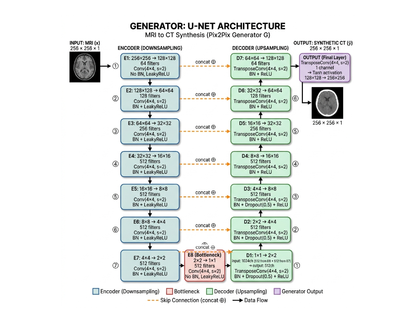
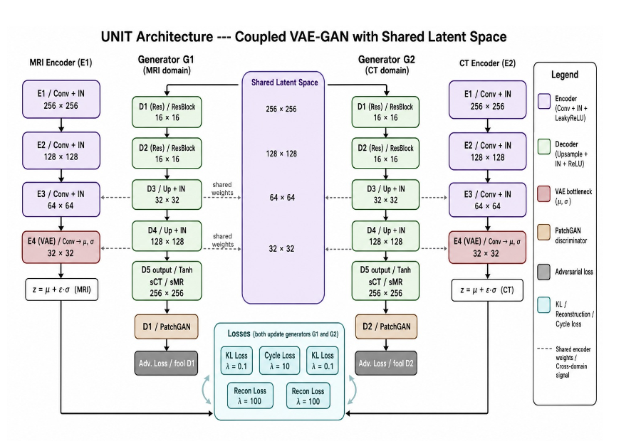
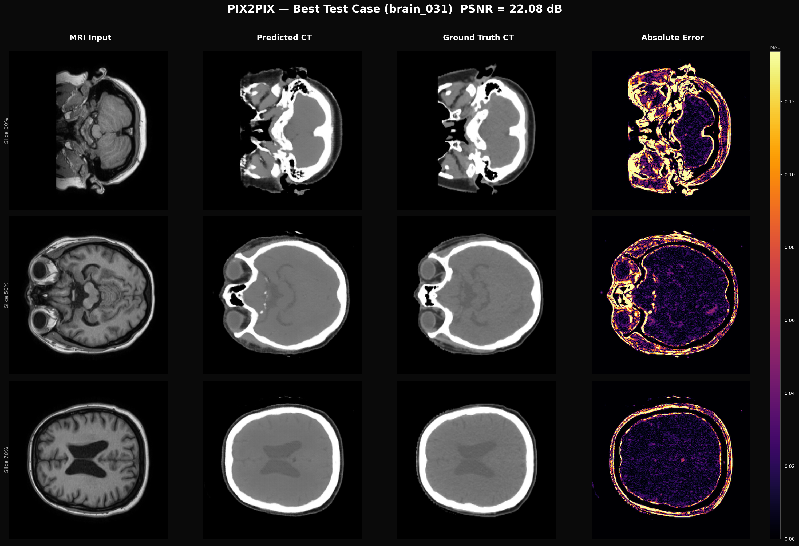
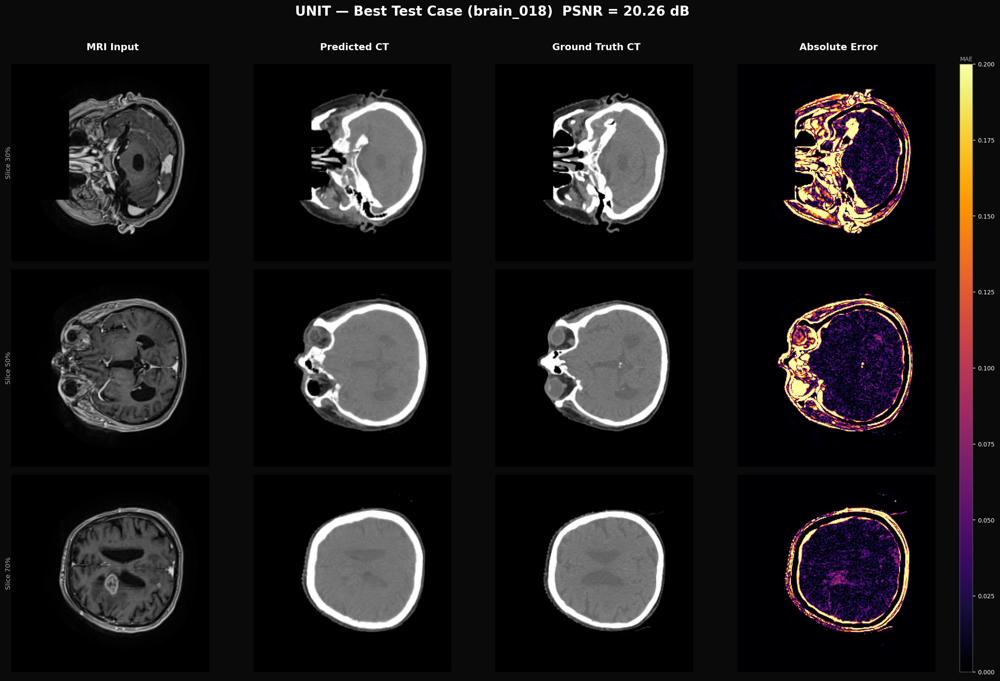

# GAN Approaches — MRI-to-CT Synthesis

Two **paired and unpaired image-to-image translation** models for MRI → Synthetic CT generation: **Pix2Pix** (supervised, paired) and **UNIT** (unsupervised, shared-latent-space). Both operate on 2D slices extracted from 3D brain volumes and are evaluated under 5-fold cross-validation.

---

## Folder Structure

```
gan_approaches/
├── README.md
├── requirements.txt
├── GAN_families.csv              # Summary table of GAN families
│
├── configs/                       # YAML experiment configs
│   ├── pix2pix_train.yaml
│   ├── pix2pix_test.yaml
│   ├── unit_train.yaml
│   ├── unit_test.yaml
│   └── create_CrossValidation_2d.yaml
│
├── data/                          # Data path references for k-fold CSVs
│
├── src/
│   ├── model/
│   │   ├── Pix2Pix/               # Pix2Pix model code
│   │   │   ├── generator_model.py
│   │   │   ├── discriminator_model.py
│   │   │   ├── util_model.py
│   │   │   ├── train_kfold.py
│   │   │   └── test.py
│   │   └── Unit/                  # UNIT model code
│   │       ├── models.py          # Encoder, Generator, Discriminator
│   │       ├── generator_model.py
│   │       ├── discriminator_model.py
│   │       ├── util_model.py
│   │       ├── train_kfold.py
│   │       └── test.py
│   └── utils/
│       ├── util_general.py        # Checkpoint save/load, LR update
│       └── util_data.py           # Data loading and preprocessing
│
├── models/                        # Saved model checkpoints
│   ├── pix2pix/0/                 # Fold 0 weights
│   └── unit/0/
│
├── results/                       # Test predictions and evaluation outputs
│   ├── best_test_result_pix2pix.png
│   ├── best_test_result_unit.png
│   ├── dosimetric_metrics_pix2pix.csv
│   └── dosimetric_metrics_unit.csv
├── logs/                          # Training logs
└── scripts/                       # Evaluation and export utilities
    ├── evaluate_dosimetry_gan.py
    ├── evaluate_pix2pix_volume_psnr.py
    ├── evaluate_unit_volume_psnr.py
    ├── export_pix2pix_comparison_panels.py
    └── export_unit_comparison_panels.py
```

---

## Model 1 — Pix2Pix

A **supervised paired image-to-image** translation model. The generator learns a direct MRI → CT mapping from aligned pairs; the discriminator enforces photorealism via a PatchGAN loss.

### Architecture



### Loss

```
L_total = BCE(D(MRI, G(MRI)), 1) + λ · L1(G(MRI), CT_gt)
λ = 100
```

### Pix2Pix Hyperparameters

| Parameter | Value |
|---|---|
| Optimizer | Adam (β₁=0.5, β₂=0.999) |
| Learning rate | 2 × 10⁻⁴ |
| Epochs | 40 |
| Early stopping | patience = 8 |
| Warm-up epochs | 5 |
| Batch size | 16 |
| Image size | 256 × 256 |
| L1 lambda | 100 |
| GP lambda | 10 |
| Cross-validation | 5-fold |
| Generator features | 64 → 128 → 256 → 512 |
| Dropout in decoder | 0.5 (first 3 up-blocks) |

---

## Model 2 — UNIT (Unsupervised Image-to-Image Translation)

An **unsupervised** model that learns a shared latent space between MRI and CT domains. Each domain has a private encoder+generator pair; a shared residual block enforces domain-invariant features. Translation requires no paired training data — alignment is enforced via cycle-consistency and KL divergence.

### Architecture



### Loss

```
L_total = λ₀·L_GAN(D₁, D₂)
        + λ₁·KL(z₁) + λ₂·L1(G₁(E₂(CT)), MRI)   ← cycle MRI
        + λ₃·KL(z₂) + λ₄·L1(G₂(E₁(MRI)), CT)   ← cycle CT
```

### UNIT Hyperparameters

| Parameter | Value |
|---|---|
| Optimizer | Adam |
| Learning rate | 1 × 10⁻⁴ |
| Epochs | 40 |
| Early stopping | patience = 8 |
| Warm-up epochs | 5 |
| Batch size | 8 |
| Image size | 256 × 256 |
| Encoder base dim | 64 |
| Downsample levels | 2 |
| λ₀ (GAN) | 10 |
| λ₁ (KL₁) | 0.1 |
| λ₂ (cycle₁) | 100 |
| λ₃ (KL₂) | 0.1 |
| λ₄ (cycle₂) | 100 |
| Cross-validation | 5-fold |

---

## Running

### Train Pix2Pix

```bash
python src/model/Pix2Pix/train_kfold.py --config configs/pix2pix_train.yaml

# Single fold (e.g. fold 0):
FOLD_IDX=0 python src/model/Pix2Pix/train_kfold.py --config configs/pix2pix_train.yaml
```

### Train UNIT

```bash
python src/model/Unit/train_kfold.py --config configs/unit_train.yaml

# Single fold:
FOLD_IDX=0 python src/model/Unit/train_kfold.py --config configs/unit_train.yaml
```

### Test / Inference

```bash
python src/model/Pix2Pix/test.py --config configs/pix2pix_test.yaml
python src/model/Unit/test.py    --config configs/unit_test.yaml
```

### Volumetric Evaluation

```bash
python scripts/evaluate_pix2pix_volume_psnr.py
python scripts/evaluate_unit_volume_psnr.py
python scripts/evaluate_dosimetry_gan.py
```

---

## Results

### Image Quality

| Model | PSNR ↑ | SSIM ↑ |
|---|---|---|
| Pix2Pix | 22.08 dB | 0.8697 |
| UNIT | 20.26 dB | 0.8268 |

### Dosimetric Performance

| Metric | Pix2Pix | UNIT |
|---|---|---|
| Air MAE | 822.65 HU | 828.76 HU |
| Soft Tissue MAE | 24.01 HU | 36.73 HU |
| Bone MAE | 791.32 HU | 781.42 HU |
| RED MAE | 0.6103 | 0.6581 |
| Gamma (1% / 1mm) | 28.44% | 23.61% |
| Gamma (2% / 2mm) | 34.28% | 29.56% |

> Both GAN models operate on **2D axial slices** extracted from 3D volumes. The low Gamma-Index values and high Bone/Air MAE reflect the absence of volumetric 3D context — slice-by-slice synthesis cannot enforce the HU calibration consistency required for reliable dosimetric planning.

### Sample Results

**Pix2Pix** — best test case (sample 031, PSNR 22.08 dB) · MRI Input · Predicted CT · Ground Truth CT · Absolute Error:



**UNIT** — best test case (sample 018, PSNR 20.26 dB) · MRI Input · Predicted CT · Ground Truth CT · Absolute Error:



Full dosimetric metrics: [`results/dosimetric_metrics_pix2pix.csv`](results/dosimetric_metrics_pix2pix.csv) · [`results/dosimetric_metrics_unit.csv`](results/dosimetric_metrics_unit.csv)

---

## Documents

- `GAN_families.csv` — table summarising the characteristics of the two GAN families implemented here
- `models/pix2pix/info.csv` and `models/unit/info.csv` — per-run experiment metadata (batch size, epochs, img dim)

---

## Contact

For questions and comments, feel free to contact: b23193@students.iitmandi.ac.in, b23334@students.iitmandi.ac.in