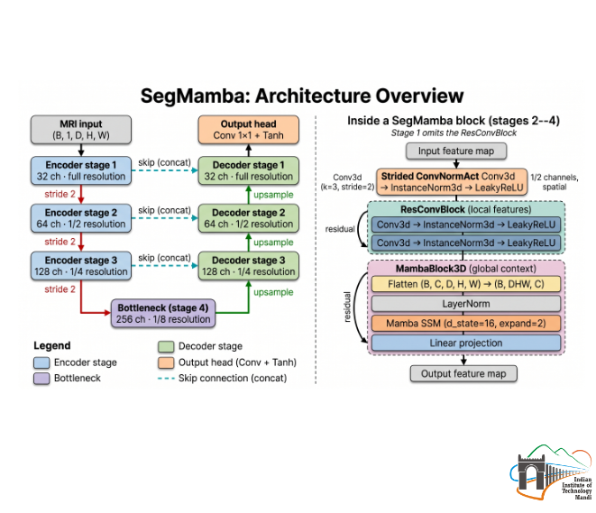

# SegMamba — MRI-to-CT Synthesis

SegMamba is a hybrid 3D U-Net that fuses CNN local feature extraction with Mamba State Space Models (SSM) for long-range sequence modeling, adapted for single-channel MRI → Synthetic CT translation on brain data.

---

## Folder Contents

```
SegMamba/
├── README.md
├── run_training.sh                # Training launch script
├── run_eval.sh                    # Evaluation launch script
├── run_viz.sh                     # Visualization generation script
├── segmamba_report.md             # Detailed architecture report
│
├── checkpoints/
│   ├── segmamba_best.pth          # Best model weights (lowest val loss)
│   ├── segmamba_epoch50.pth … segmamba_epoch500.pth
│   ├── segmamba_train_log.txt
│   └── segmamba_test_results.txt
│
├── predictions/                   # Test-set .npy arrays (37 cases)
│
└── visualizations/                # Side-by-side MRI | Pred CT | GT CT (37 PNGs)
    ├── brain_001_comparison.png
    └── …  brain_037_comparison.png
```

> Shared source code: [`../src/`](../src/) — `models.py`, `train.py`, `evaluate.py`, `dataset.py`, `losses.py`, `visualize.py`, `dosometric.py`

---

## End-to-End Architecture



---

## Training Pipeline

### Hyperparameters

| Parameter | Value |
|---|---|
| Optimizer | Adam (β₁=0.9, β₂=0.999) |
| Initial LR | 5 × 10⁻⁴ |
| LR schedule | Cosine annealing · T_max=500 · η_min=1×10⁻⁶ |
| Epochs | 500 |
| Batch size | 2 |
| Patch size | (64, 192, 192) D×H×W |
| Base channels | 32 → 64 → 128 → 256 |
| SSM state dim | 16 |
| Parameters | ~18 M |
| Mixed precision | AMP (fp16) |
| Checkpoint save | Every 50 epochs + best val |

### Loss Schedule

| Phase | Epochs | Components | HU tissue weights |
|---|---|---|---|
| Warmup | 1 – 99 | wMAE | Bone 3.0 · Soft tissue 1.5 · Air 0.5 |
| Full | 100 – 500 | wMAE + SSIM + AFP | same |

**AFP** = Anatomical Feature Preservation loss on high-gradient regions.

---

## Running

```bash
# From inside SegMamba/
bash run_training.sh

# Or directly:
python ../src/train.py \
    --data_dir /DATA/divyansh/mc_ddpm_data/brain_npy \
    --model segmamba \
    --epochs 500 \
    --batch_size 2 \
    --lr 5e-4 \
    --base_ch 32 \
    --save_dir ./checkpoints
```

### Evaluate

```bash
bash run_eval.sh

# Or directly:
python ../src/evaluate.py \
    --data_dir /DATA/divyansh/mc_ddpm_data/brain_npy \
    --checkpoint ./checkpoints/segmamba_best.pth \
    --model segmamba \
    --save_preds
```

---

## Results

### Image Quality (37 test cases)

| Metric | Score | Std Dev |
|---|---|---|
| MAE | 0.0480 | ± 0.0079 |
| PSNR | 24.79 dB | ± 1.19 dB |
| SSIM | 0.8432 | ± 0.0369 |

### Dosimetric Performance

| Metric | SegMamba |
|---|---|
| PSNR (3D) | 24.79 dB |
| PSNR (2D) | 25.42 dB |
| PSNR (1D) | 32.84 dB |
| SSIM | 0.8374 |
| Air MAE | 65.74 HU |
| Soft Tissue MAE | 38.15 HU |
| Bone MAE | 208.52 HU |
| RED MAE | 0.05208 |
| Gamma (1% / 1mm) | 91.61% |
| Gamma (2% / 2mm) | 99.35% |

---

## Sample Results

Best test case — brain_017 (PSNR 26.81 dB) — MRI Input · Predicted CT · Ground Truth CT · Absolute Error:


> All 37 test comparisons: [`visualizations/`](visualizations/)
