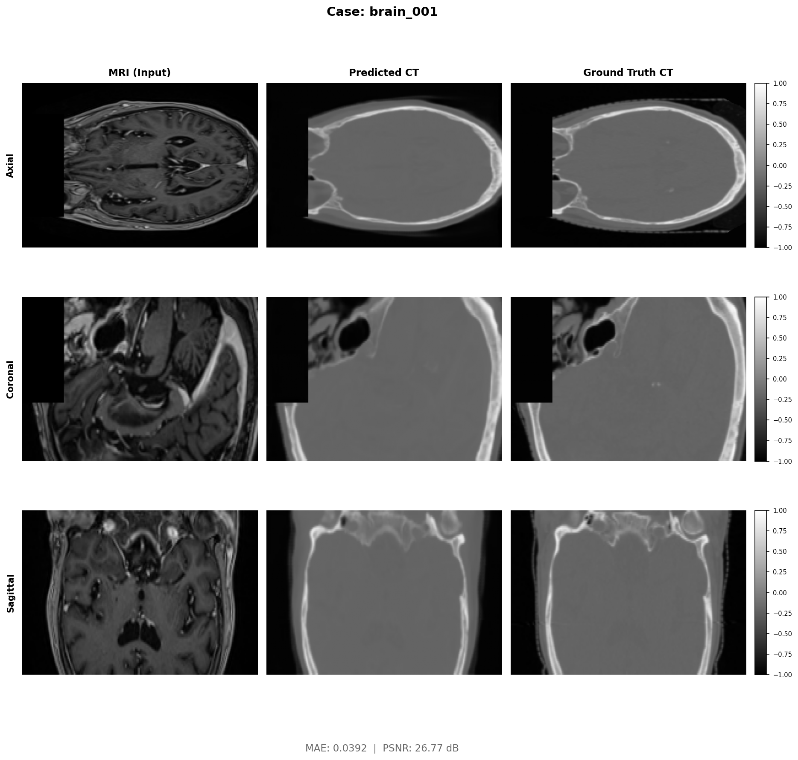
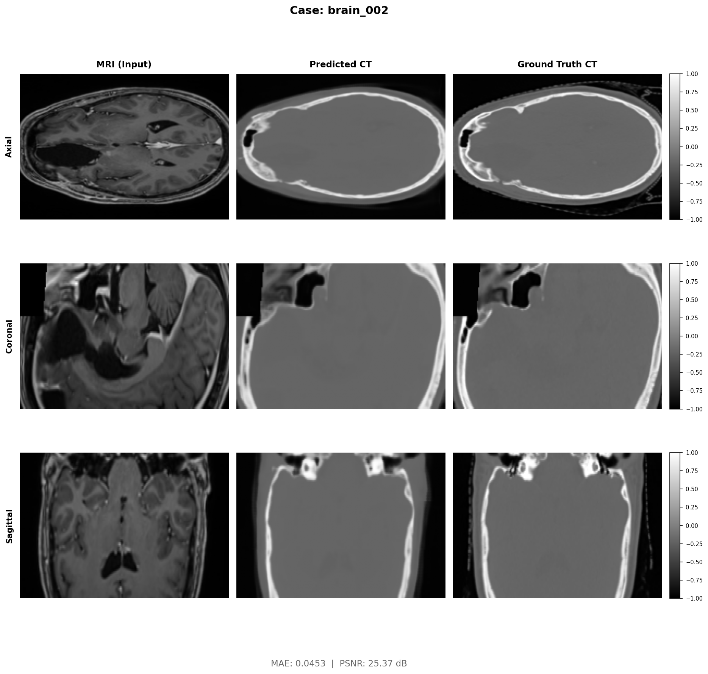
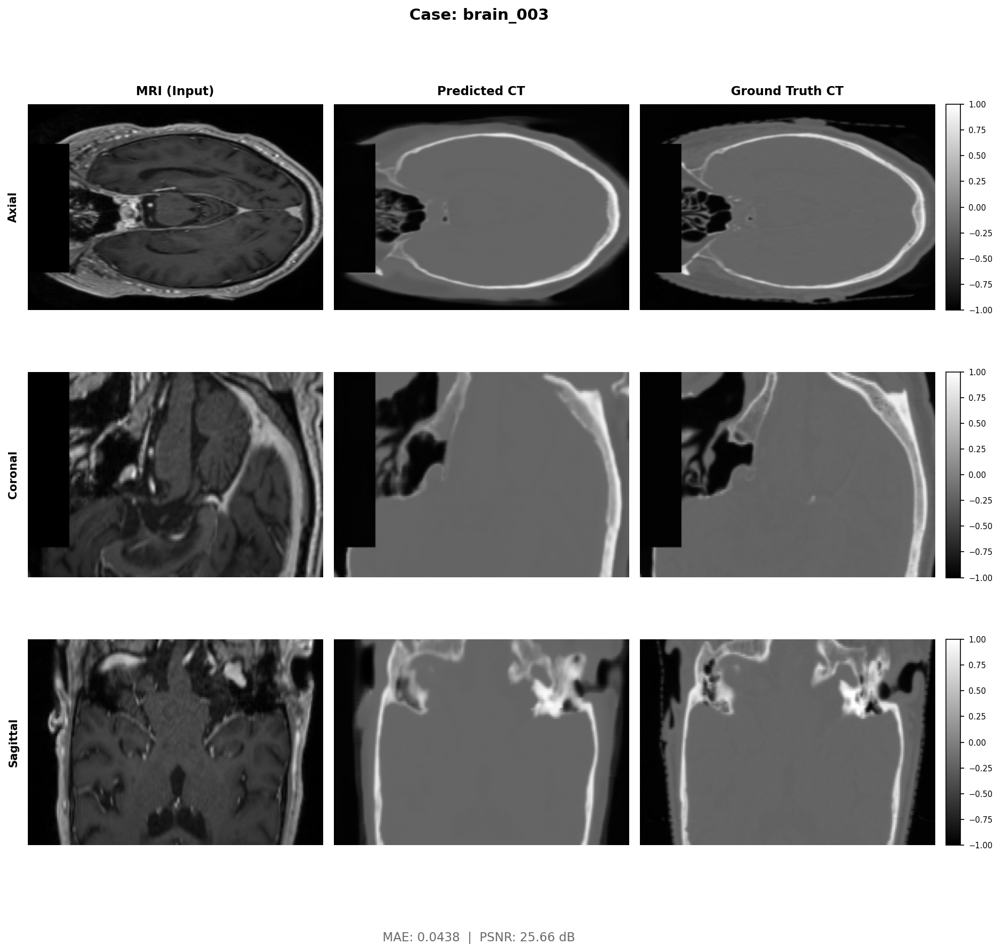

# SegMamba — MRI-to-CT Synthesis

SegMamba is a hybrid 3D U-Net that fuses CNN local feature extraction with Mamba State Space Models (SSM) for long-range sequence modeling, adapted for single-channel MRI → Synthetic CT translation on brain data.

---

## Folder Contents

```
SegMamba/
├── README.md
├── run_training.sh                # Training launch script
├── run_eval.sh                    # Evaluation launch script
├── run_viz.sh                     # Visualization generation script
├── training_output.log            # Full training log (500 epochs)
├── segmamba_report.md             # Detailed architecture report
│
├── checkpoints/
│   ├── segmamba_best.pth          # Best model weights (lowest val loss)
│   ├── segmamba_epoch50.pth       # Checkpoints every 50 epochs
│   ├── ...
│   ├── segmamba_epoch500.pth
│   ├── segmamba_train_log.txt     # Per-epoch loss values
│   ├── segmamba_test_results.txt  # Final test-set metrics
│   └── visuals/                   # Per-epoch training dashboards (500 PNGs)
│       ├── dashboard_epoch_001.png
│       └── ...  dashboard_epoch_500.png
│
├── predictions/                   # Test-set prediction arrays
│   └── brain_001.npy … brain_037.npy
│
└── visualizations/                # Side-by-side MRI | Pred CT | Real CT
    ├── brain_001_comparison.png
    └── …  brain_037_comparison.png
```

> Shared source code lives in [`../src/`](../src/) — `models.py`, `train.py`, `evaluate.py`, `dataset.py`, `losses.py`, `visualize.py`, `dosometric.py`.

---

## Architecture

SegMamba follows a 4-level symmetric U-Net. Each encoder/decoder stage uses a **SegMambaBlock**: residual CNN feature extraction followed by a Mamba SSM scan over the spatial tokens. Skip connections use standard concatenation (no attention gating).

```
MRI (1, D, H, W)
    └─ Stem (ConvNormAct × 2)
        ├─ Enc1 ──Down1──> Enc2 ──Down2──> Enc3 ──Down3──> Enc4 (bottleneck)
        │                                                        ↓
        └──────────────────────────────────────────────  Up3 + skip(Enc3) → Dec3
                                                         Up2 + skip(Enc2) → Dec2
                                                         Up1 + skip(Enc1) → Dec1
                                                                  ↓
                                                          Head (Conv3d + Tanh)
                                                                  ↓
                                                         Synthetic CT (1, D, H, W)
```

| Hyperparameter | Value |
|---|---|
| Base channels | 32 → 64 → 128 → 256 |
| SSM state dim (`d_state`) | 16 |
| Patch size | (64, 192, 192) D×H×W |
| Parameters | ~18 M |

---

## Training

```bash
# From inside SegMamba/
bash run_training.sh

# Or directly:
python ../src/train.py \
    --data_dir /DATA/divyansh/mc_ddpm_data/brain_npy \
    --model segmamba \
    --epochs 500 \
    --batch_size 2 \
    --lr 5e-4 \
    --base_ch 32 \
    --save_dir ./checkpoints
```

### Loss Schedule

| Phase | Epochs | Loss Components |
|---|---|---|
| Warmup | 1 – 99 | Weighted HU-aware MAE |
| Full | 100 – 500 | wMAE + SSIM + AFP |

HU tissue weights: **Bone 3.0 · Soft tissue 1.5 · Air 0.5**

---

## Evaluation

```bash
bash run_eval.sh

# Or directly:
python ../src/evaluate.py \
    --data_dir /DATA/divyansh/mc_ddpm_data/brain_npy \
    --checkpoint ./checkpoints/segmamba_best.pth \
    --model segmamba \
    --save_preds
```

---

## Results

### Test-Set Metrics

| Metric | Score | Std Dev |
|---|---|---|
| MAE | 0.0480 | ± 0.0079 |
| PSNR | 24.79 dB | ± 1.19 dB |
| SSIM | 0.8432 | ± 0.0369 |

### Dosimetric Performance

| Metric | SegMamba |
|---|---|
| PSNR (3D) | 24.79 dB |
| PSNR (2D) | 25.42 dB |
| PSNR (1D) | 32.84 dB |
| SSIM | 0.8374 |
| Air MAE | 65.74 HU |
| Soft Tissue MAE | 38.15 HU |
| Bone MAE | 208.52 HU |
| RED MAE | 0.05208 |
| Gamma (1% / 1mm) | 91.61% |
| Gamma (2% / 2mm) | 99.35% |

---

## Visualizations

Training dashboard at epoch 500:


Test-set comparison — MRI · Predicted CT · Ground-truth CT:





> All 37 test comparisons: [`visualizations/`](visualizations/)

---

## Model Weights

| File | Notes |
|---|---|
| `checkpoints/segmamba_best.pth` | Best validation checkpoint — use for inference |
| `checkpoints/segmamba_epoch500.pth` | Final epoch |
| `checkpoints/segmamba_epoch*.pth` | Intermediate saves every 50 epochs |
