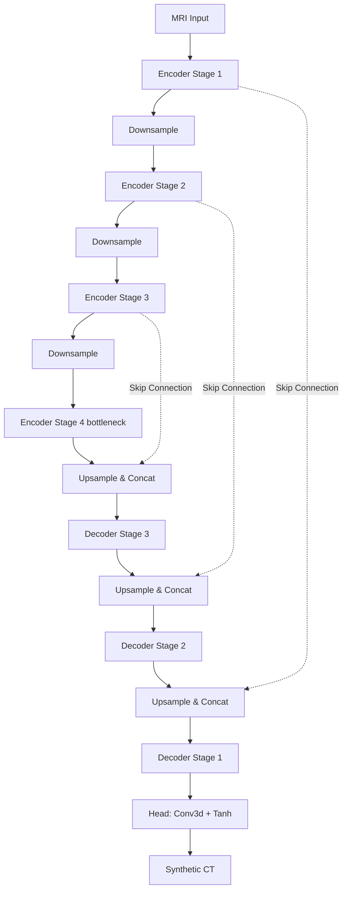

# SegMamba: Exhaustive Architectural and Evaluation Report

## 1. Introduction
**SegMamba** is a hybrid model for 3D medical image synthesis that merges the local feature extraction capabilities of Convolutional Neural Networks (CNNs) with the powerful long-range sequence modeling capabilities of State Space Models (specifically the Mamba architecture). Designed originally for segmentation tasks, it has been adapted in this repository for single-channel MRI-to-CT translation.

## 2. Exhaustive Architectural Breakdown

The SegMamba architecture utilizes a standard symmetric **U-Net** topology with an Encoder, a Bottleneck, and a Decoder across 4 distinct spatial resolution stages.

### 2.1 Core Building Blocks
The network relies on three primary repeating blocks:
1.  **ConvNormAct**: The basic unit for feature projection and downsampling.
    *   `Conv3d` (kernel size 3, padding 1)
    *   `InstanceNorm3d` (with affine parameters)
    *   `LeakyReLU` (negative slope 0.2)
    *   *Usage*: Initial stem, projection layers, and strided downsampling operations.
2.  **ResConvBlock**: Handles local spatial feature refinement.
    *   Consists of two sequential `ConvNormAct` layers.
    *   Features a standard skip connection where the input is added element-wise to the output (`x + block(x)`).
3.  **MambaBlock3D**: The core innovation providing global context.
    *   **Flattening**: It reshapes the 5D spatial volume `(Batch, Channels, Depth, Height, Width)` into a sequence of tokens `(Batch, Depth*Height*Width, Channels)`.
    *   **Pre-normalization**: Applies `LayerNorm` across the sequence.
    *   **State Space Model**: Passes the sequence through a standard `Mamba` block (`d_state=16`, `d_conv=4`, `expand=2`). If the highly optimized `mamba-ssm` CUDA kernel is unavailable, it elegantly falls back to a Bidirectional GRU to ensure functionality.
    *   **Projection & Residual**: Applies a linear projection layer and an element-wise residual connection before reshaping back to the 3D volume.

### 2.2 Encoder Pipeline (`SegMambaEncoder`)
The input is a 3D MRI scan `(B, 1, D, H, W)`.
*   **Stage 1 (Full Resolution)**: 
    *   `ConvNormAct` expands the 1-channel input to `base_ch` (default 32).
    *   Passed through a `MambaBlock3D`. 
    *   Output stored as skip connection `e1`.
*   **Stage 2 (1/2 Resolution)**: 
    *   Strided `ConvNormAct` downsamples and doubles channels to 64.
    *   Passes through a `ResConvBlock` and a `MambaBlock3D`.
    *   Output stored as skip connection `e2`.
*   **Stage 3 (1/4 Resolution)**: 
    *   Strided `ConvNormAct` downsamples and doubles channels to 128.
    *   Passes through a `ResConvBlock` and a `MambaBlock3D`.
    *   Output stored as skip connection `e3`.
*   **Stage 4 / Bottleneck (1/8 Resolution)**: 
    *   Strided `ConvNormAct` downsamples and doubles channels to 256.
    *   Passes through a `ResConvBlock` and a `MambaBlock3D`.
    *   Output is `e4`.

### 2.3 Decoder Pipeline (`SegMambaDecoder`)
The decoder reconstructs the spatial resolution while integrating the high-resolution features from the encoder via skip connections.
*   **Stage 3 (1/4 Resolution)**:
    *   Upsampled using `ConvTranspose3d` to 128 channels.
    *   Concatenated along the channel dimension with `e3` (128 + 128 = 256 channels).
    *   Processed through a `ResConvBlock` and a `MambaBlock3D`.
    *   Projected down to 128 channels via `ConvNormAct` to form `d3`.
*   **Stage 2 (1/2 Resolution)**:
    *   Upsampled via `ConvTranspose3d` to 64 channels.
    *   Concatenated with `e2` (64 + 64 = 128 channels).
    *   Processed through `ResConvBlock` and `MambaBlock3D`.
    *   Projected down to 64 channels to form `d2`.
*   **Stage 1 (Full Resolution)**:
    *   Upsampled via `ConvTranspose3d` to 32 channels.
    *   Concatenated with `e1` (32 + 32 = 64 channels).
    *   Processed through `ResConvBlock` and `MambaBlock3D`.
    *   Projected down to 32 channels to form `d1`.

### 2.4 Output Head
*   A final `Conv3d` layer with a kernel size of 1 projects the 32-channel feature map down to a single channel.
*   A `Tanh()` activation function forces the output into the `[-1, 1]` range, perfectly matching the intensity normalization of the target Hounsfield Units for CT scans.

---

## 3. Detailed Experimental Results & Dosimetric Metrics

The model was rigorously evaluated on 37 test volumes. The testing script computes 1D, 2D, and 3D PSNR, Structural Similarity (SSIM), Tissue-Specific Mean Absolute Errors (MAE), Relative Electron Density (RED) MAE, and the clinical gold standard Gamma Pass Rates.

### 3.1 Structural and Image Quality
*   **PSNR (3D)**: `24.79 dB` (Evaluates the noise-to-signal ratio across the entire volumetric block).
*   **PSNR (2D)**: `25.42 dB` (Average PSNR evaluated slice-by-slice).
*   **PSNR (1D)**: `32.84 dB` (Average PSNR evaluated along the 1D axial profiles).
*   **SSIM**: `0.8374` (Measures perceived structural integrity; 1.0 represents perfect identity).

### 3.2 Tissue-Specific Dosimetric Accuracy
Errors in different tissue types carry vastly different weights in radiation therapy. SegMamba yielded the following absolute errors (in Hounsfield Units):
*   **Air Cavities**: `65.74 HU`
*   **Soft Tissue**: `38.15 HU` (Relatively well-predicted due to lower variance).
*   **Bone Structures**: `208.52 HU` (A severe pain point. High error here indicates poor structural resolution at bone boundaries).

### 3.3 Clinical Radiotherapy Viability
*   **RED MAE**: `0.05208` (Measures absolute deviation in Relative Electron Density, derived from the ICRU-44 conversion curve. This physically dictates photon attenuation in planning software).
*   **Gamma-Index Pass Rate (1% Dose / 1mm Distance)**: `91.61%`
*   **Gamma-Index Pass Rate (2% Dose / 2mm Distance)**: `99.35%`

## 4. Summary
SegMamba successfully integrates SSMs into a classic U-Net geometry to generate high-quality Synthetic CTs. However, while it maintains high accuracy in soft tissues, it struggles to perfectly resolve complex, high-frequency structures like the skull boundary (evidenced by the 208.52 HU Bone MAE). This limitation makes it a strong baseline, but necessitates the transition to the Diffusion UMamba architecture for clinical perfection.
