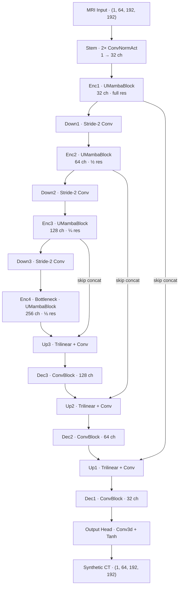
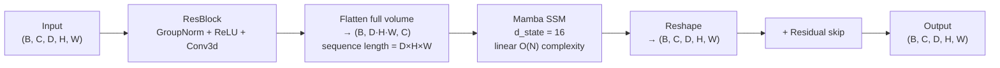
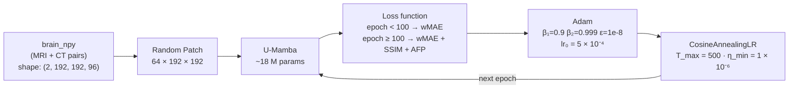
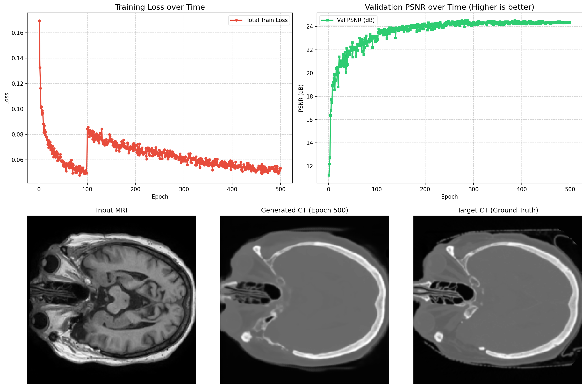

# U-Mamba — MRI-to-CT Synthesis

U-Mamba replaces transformer self-attention blocks inside the U-Net encoder with **Mamba State Space Model (SSM)** blocks, giving linear-time long-range context modeling at lower memory cost. Trained for MRI → Synthetic CT on brain data.

---

## Folder Contents

```
UMamba/
├── README.md
├── run_training.sh                # Training launch script
├── run_eval.sh                    # Evaluation launch script
├── run_viz.sh                     # Visualization generation script
├── umamba_report.md               # U-Mamba architecture report
├── unet_umamba_report.md          # UNet-Mamba variant report
├── diffusion_mamba_models.py      # Diffusion-UMamba model definitions
├── main_diffusionUmamba.py        # Diffusion-UMamba training entry point
│
├── checkpoints/
│   ├── umamba_best.pth            # Best model weights (lowest val loss)
│   ├── umamba_epoch50.pth … umamba_epoch500.pth
│   ├── umamba_train_log.txt
│   └── umamba_test_results.txt
│
├── predictions/                   # Test-set .npy arrays (37 cases)
│
└── results/
    └── dashboard_final.png        # Final epoch training dashboard
```

> Shared source code: [`../src/`](../src/) — `models.py`, `train.py`, `evaluate.py`, `dataset.py`, `losses.py`, `visualize.py`, `dosometric.py`

---

## End-to-End Architecture



### UMambaBlock (encoder stages only)

The decoder uses plain ConvBlocks; Mamba SSM is applied in the encoder path only.



> The full 3D volume is flattened into a single 1D sequence — more context than SegMamba's scan, at the cost of higher peak memory (hence batch size 1).

---

## Training Pipeline



### Hyperparameters

| Parameter | Value |
|---|---|
| Optimizer | Adam (β₁=0.9, β₂=0.999) |
| Initial LR | 5 × 10⁻⁴ |
| LR schedule | Cosine annealing · T_max=500 · η_min=1×10⁻⁶ |
| Epochs | 500 |
| Batch size | 1 (memory-constrained by full-volume flattening) |
| Patch size | (64, 192, 192) D×H×W |
| Base channels | 32 → 64 → 128 → 256 |
| SSM state dim | 16 |
| Parameters | ~18 M |
| Mixed precision | AMP (fp16) |
| Checkpoint save | Every 50 epochs + best val |

### Loss Schedule

| Phase | Epochs | Components | HU tissue weights |
|---|---|---|---|
| Warmup | 1 – 99 | wMAE | Bone 3.0 · Soft tissue 1.5 · Air 0.5 |
| Full | 100 – 500 | wMAE + SSIM + AFP | same |

---

## Running

```bash
# From inside UMamba/
bash run_training.sh

# Or directly:
python ../src/train.py \
    --data_dir /DATA/divyansh/mc_ddpm_data/brain_npy \
    --model umamba \
    --epochs 500 \
    --batch_size 1 \
    --lr 5e-4 \
    --base_ch 32 \
    --save_dir ./checkpoints
```

### Evaluate

```bash
bash run_eval.sh

# Or directly:
python ../src/evaluate.py \
    --data_dir /DATA/divyansh/mc_ddpm_data/brain_npy \
    --checkpoint ./checkpoints/umamba_best.pth \
    --model umamba \
    --save_preds
```

---

## Results

### Image Quality (37 test cases)

| Metric | Score | Std Dev |
|---|---|---|
| MAE | 0.0443 | ± 0.0075 |
| PSNR | 25.23 dB | ± 1.30 dB |
| SSIM | 0.8531 | ± 0.0358 |

U-Mamba outperforms SegMamba on all three standard metrics.

### Dosimetric Performance vs SegMamba

| Metric | UMamba | SegMamba | Delta |
|---|---|---|---|
| PSNR (3D) | **25.23 dB** | 24.79 dB | +0.44 dB |
| PSNR (2D) | **25.78 dB** | 25.42 dB | +0.36 dB |
| PSNR (1D) | **33.88 dB** | 32.84 dB | +1.04 dB |
| SSIM | **0.8509** | 0.8374 | +0.0135 |
| Air MAE | **60.53 HU** | 65.74 HU | −5.21 HU |
| Soft Tissue MAE | **35.43 HU** | 38.15 HU | −2.72 HU |
| Bone MAE | **192.50 HU** | 208.52 HU | −16.02 HU |
| RED MAE | **0.04794** | 0.05208 | −0.00414 |
| Gamma (1% / 1mm) | **93.26%** | 91.61% | +1.65% |
| Gamma (2% / 2mm) | **99.55%** | 99.35% | +0.20% |

---

## Sample Results

Final epoch training dashboard (Input MRI · Generated CT · Target CT · Error Map):


