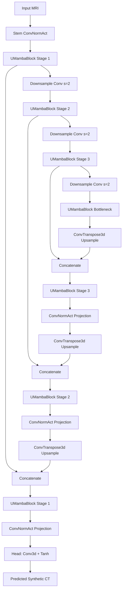

# UNet UMamba: Architectural and Training Strategy Report

## 1. Introduction
The **UNet UMamba** approach implements a deterministic, end-to-end encoder-decoder network for MRI-to-CT synthesis. It retains the self-configuring, hierarchical structure of the renowned nnU-Net but integrates modern State-Space Models (SSMs). Specifically, it replaces standard sequential convolutional bottleneck blocks with custom **`UMambaBlock`** units to dramatically increase the model's global receptive field while maintaining computational efficiency.

Unlike diffusion-based variants, this model performs a direct forward prediction, outputting the synthetic CT volume directly from the input MRI volume in a single pass.

## 2. Exhaustive Architectural Breakdown

The network takes a single-channel MRI input `(Batch, 1, Depth, Height, Width)` and outputs a single-channel predicted CT volume `(Batch, 1, Depth, Height, Width)` normalized to the range `[-1, 1]`.

### 2.1 Core Processing Unit: `UMambaBlock`
This custom block operates sequentially to extract both local textural features and global context:
1.  **Local Feature Extraction (`ResConvBlock`)**: Two sequential 3D convolutions with `InstanceNorm3d` and `LeakyReLU` activations. This provides essential local spatial priors.
2.  **Global Context Modeling (`MambaBlock3D`)**: The 3D feature map is flattened into a 1D sequence of tokens `(B, D*H*W, C)`. It passes through a LayerNorm and then the core **Mamba** state-space mechanism. Mamba scans the sequence efficiently, providing infinite receptive field modeling without the quadratic scaling bottleneck of self-attention. The output is linearly projected, added to a residual skip connection, and reshaped back to 3D.
3.  **Normalization**: The block is finalized with a 3D Instance Normalization layer (`InstanceNorm3d`).

*(Note: If `mamba-ssm` is uninstalled, the model gracefully falls back to a `FallbackSSMBlock` utilizing GRUs to approximate the sequential modeling).*

### 2.2 Encoder and Decoder Flow
*   **Encoder**: Operates across 4 spatial resolutions (`base_ch` -> `base_ch*2` -> `base_ch*4` -> `base_ch*8`). Downsampling is strictly performed by strided convolutions (`stride=2`).
*   **Skip Connections**: Standard spatial concatenation is used to pass high-resolution spatial priors from the encoder directly to the decoder.
*   **Decoder**: Upsampling is handled by transposed convolutions (`ConvTranspose3d`). The concatenated features are processed by a `UMambaBlock` and subsequently projected via a `ConvNormAct` layer to half the channel capacity.

### 2.3 Output Head
*   **Head**: A simple 1x1 3D Convolution reduces the feature dimensionality to the target `out_ch=1`.
*   **Activation**: A `Tanh` activation function is applied. This strictly bounds the network's output to the `[-1, 1]` range, matching the normalized Hounsfield Unit (HU) space of the target CTs.

---

## 3. Highly Specialized Training Loss Functions

The model is trained using a sophisticated **Compound Staged Loss** mechanism designed to prioritize critical radiotherapeutic anatomical structures. 

### 3.1 Anatomically-Aware Base Losses
1.  **Weighted HU-aware MAE (`WeightedMAELoss`)**: Standard L1/MAE treats all errors equally. This loss applies anatomical intensity thresholds:
    *   **Bone (HU > 300)**: Multiplied by a factor of **3.0x**.
    *   **Soft Tissue**: Multiplied by a factor of **1.5x**.
    *   **Air/Background (HU < -700)**: Scaled down to **0.5x**.
    *   *Result*: Forces the UMamba network to correctly synthesize dense bone boundaries, which dominate dose attenuation physics in radiotherapy.
2.  **3D SSIM Loss (`SSIMLoss`)**: Operates on local spatial patches using a Gaussian kernel to measure and enforce structural similarity, preventing blurry generations.
3.  **Anatomical Feature-Prioritized Loss (`AFPLoss`)**: A perceptual-style loss computed using a frozen multi-scale 3D CNN encoder. By comparing the intermediate feature maps of the predicted CT vs. ground truth CT, it enforces higher-order structural fidelity.

### 3.2 Staged Training Strategy
The `CompoundLoss` orchestrates the learning dynamically across epochs:
*   **Phase 1 (Epoch 0 - 99): Absolute Intensity Alignment**
    *   *Loss*: `WeightedMAELoss` (100% contribution).
    *   *Goal*: Rapidly force the network to understand the mapping between MRI signals and correct CT Hounsfield Units, heavily prioritizing the skeletal structure.
*   **Phase 2 (Epoch 100+): Structural and Perceptual Refinement**
    *   *Loss*: `1.0 * wMAE + 0.1 * SSIM + 0.1 * AFP`.
    *   *Goal*: Once absolute intensities are established, the network focuses on sharpening boundaries and aligning complex internal textures using the SSIM and deep perceptual (AFP) penalties.

---

## 4. Dosimetric Analysis and Results

The UNet UMamba architecture was quantitatively assessed using structural and highly critical tissue-specific dosimetric metrics. 

### 4.1 Structural Metrics
- **PSNR (3D)**: `25.23 dB`
- **PSNR (2D)**: `25.78 dB`
- **PSNR (1D)**: `33.88 dB`
- **SSIM**: `0.8509`

### 4.2 Tissue-Specific Accuracy
Evaluating raw Hounsfield Units within defined clinical anatomical density ranges:
- **Bone Structures**: `192.50 HU` Mean Absolute Error
- **Air Cavities**: `60.53 HU` Mean Absolute Error
- **Soft Tissue**: `35.43 HU` Mean Absolute Error

### 4.3 Dosimetric and Clinical Viability
- **RED MAE (Relative Electron Density)**: `0.0479`
- **Gamma-Index Pass Rate (1% / 1mm)**: `93.26%`
- **Gamma-Index Pass Rate (2% / 2mm)**: `99.55%`

These metrics validate the network's high precision in tissue density translation, achieving near-perfect strict clinical alignment (Gamma 2%/2mm > 99%).
