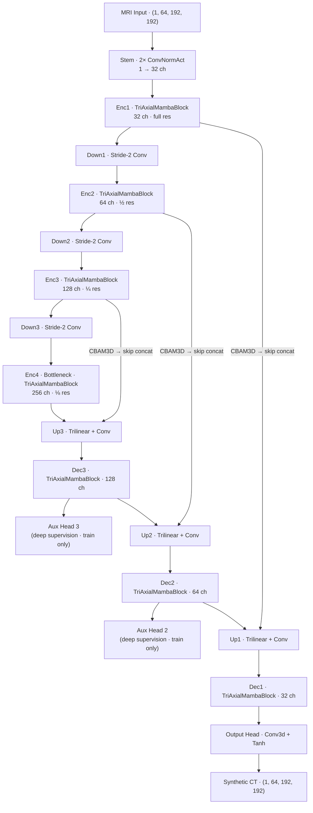
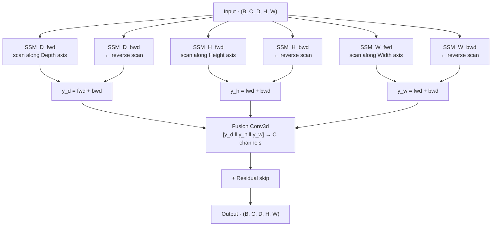
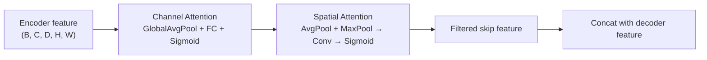
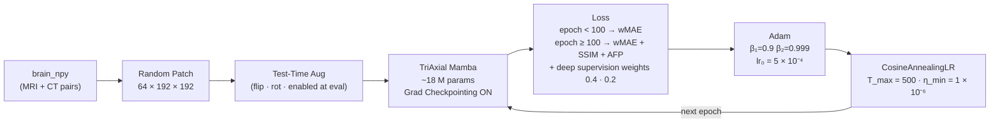
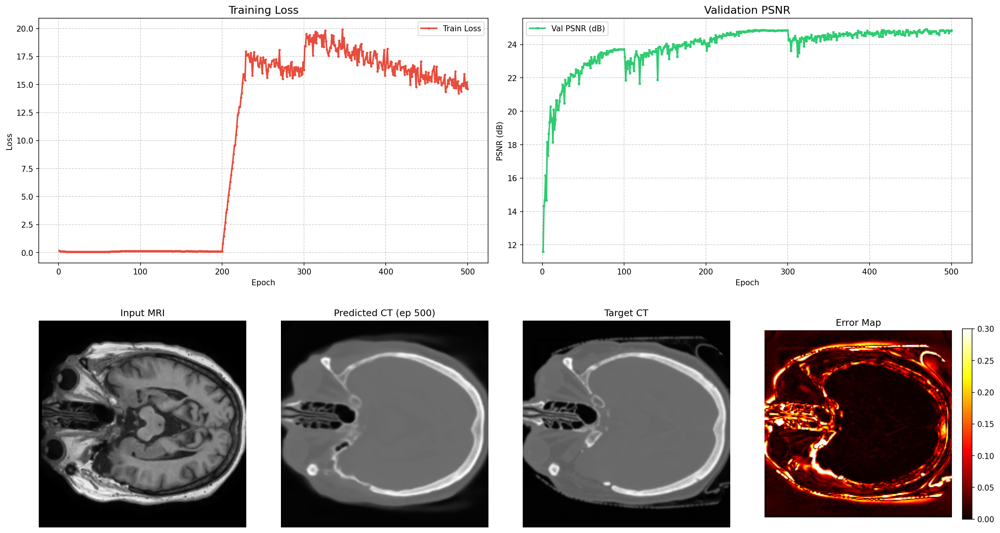

# TriAxial Mamba (TriMamba-UNet V2) — MRI-to-CT Synthesis

TriAxial Mamba scans the 3D feature volume along the **D (Depth)**, **H (Height)**, and **W (Width)** axes sequentially and bidirectionally using Mamba SSMs. This avoids flattening the entire 3D volume at once, reducing peak VRAM while still capturing full 3D global context.

---

## Folder Structure

```
triaxial_mamba/
├── README.md
├── Triaxial_Mamba_Report.md           # Full technical report
├── models.py                          # TriMamba-UNet V2 architecture
├── train.py                           # Training script
├── evaluate.py                        # Inference + MAE / PSNR / SSIM
├── evaluate_dosimetric.py             # RED / Gamma-index dosimetric analysis
├── dataset.py                         # Data loader
├── losses.py                          # Loss functions
├── visualize.py                       # Generates comparison PNGs
├── environment.yml                    # Conda environment spec
├── run_training_trimamba.sh
├── resume_training_trimamba.sh
├── run_eval_trimamba.sh
├── architecture.html                  # Interactive architecture diagram
│
├── checkpoints_trimamba/
│   ├── trimamba_best.pth
│   ├── trimamba_epoch50.pth … trimamba_epoch500.pth
│   └── visuals/                       # Per-epoch training dashboards
│
├── predictions_trimamba/
│   ├── dosimetric_metrics.csv
│   └── brain_001.npy … brain_037.npy
│
└── results/
    └── dashboard_final.png            # Final epoch training dashboard
```

---

## End-to-End Architecture



### TriAxialMambaBlock — per-axis bidirectional scanning



### CBAM3D on skip connections



---

## Training Pipeline



### Hyperparameters

| Parameter | Value |
|---|---|
| Optimizer | Adam (β₁=0.9, β₂=0.999) |
| Initial LR | 5 × 10⁻⁴ |
| LR schedule | Cosine annealing · T_max=500 · η_min=1×10⁻⁶ |
| Epochs | 500 |
| Batch size | 1 |
| Patch size | (64, 192, 192) D×H×W |
| Base channels | 32 → 64 → 128 → 256 |
| SSM state dim | 16 |
| Parameters | ~18 M |
| Gradient checkpointing | Enabled (~60% activation memory saved) |
| Deep supervision | Aux heads at Dec2 and Dec3 (weights 0.4, 0.2) |
| Test-Time Augmentation | Enabled at inference |
| Mixed precision | AMP (fp16) |
| Upsampling | Trilinear interpolation + Conv3d |
| Checkpoint save | Every 50 epochs + best val |

### Loss Schedule

| Phase | Epochs | Components |
|---|---|---|
| Warmup | 1 – 99 | wMAE (Bone 3.0 · Soft tissue 1.5 · Air 0.5) |
| Full | 100 – 500 | wMAE + SSIM + AFP + deep supervision terms |

---

## Environment Setup

```bash
conda env create -f environment.yml
conda activate trimamba
```

Or manually:

```bash
conda create -n trimamba python=3.10 -y
conda activate trimamba
pip install torch torchvision --index-url https://download.pytorch.org/whl/cu118
pip install numpy scipy scikit-image monai
pip install causal-conv1d>=1.2.0 mamba-ssm
```

> If `mamba-ssm` fails (CUDA mismatch), the code falls back to a GRU-based SSM block automatically.

---

## Running

```bash
bash run_training_trimamba.sh

# Or directly:
python train.py \
    --data_dir /DATA/divyansh/mc_ddpm_data/brain_npy \
    --epochs 500 \
    --batch_size 1 \
    --lr 5e-4 \
    --base_ch 32 \
    --save_dir ./checkpoints_trimamba
```

### Resume

```bash
bash resume_training_trimamba.sh
```

### Evaluate

```bash
bash run_eval_trimamba.sh

# Or directly:
python evaluate.py \
    --data_dir /DATA/divyansh/mc_ddpm_data/brain_npy \
    --checkpoint ./checkpoints_trimamba/trimamba_best.pth \
    --save_preds

python evaluate_dosimetric.py \
    --pred_dir ./predictions_trimamba \
    --output_csv ./predictions_trimamba/dosimetric_metrics.csv
```

---

## Results

### Image Quality (37 test cases)

| Metric | Score | Std Dev |
|---|---|---|
| MAE | 0.0458 | ± 0.0070 |
| RMSE | 0.1041 | — |
| PSNR | 25.71 dB | ± 1.31 dB |
| SSIM | 0.8540 | ± 0.0341 |

### Dosimetric Metrics

| Metric | TriAxial Mamba |
|---|---|
| PSNR (3D) | 25.71 dB |
| PSNR (2D) | 26.32 dB |
| PSNR (1D) | 33.32 dB |
| SSIM | 0.8483 |
| Air MAE | 60.77 HU |
| Soft Tissue MAE | **38.31 HU** ← best among all Mamba variants |
| Bone MAE | 196.20 HU |
| RED MAE | 0.05012 |
| Gamma (1% / 1mm) | 88.71% |
| Gamma (2% / 2mm) | 98.83% |

---

## Sample Results

Final epoch training dashboard (Input MRI · Generated CT · Target CT · Error Map):



---

## Full Technical Report

See [Triaxial_Mamba_Report.md](Triaxial_Mamba_Report.md) for complete architecture source, training details, and ablation analysis.
