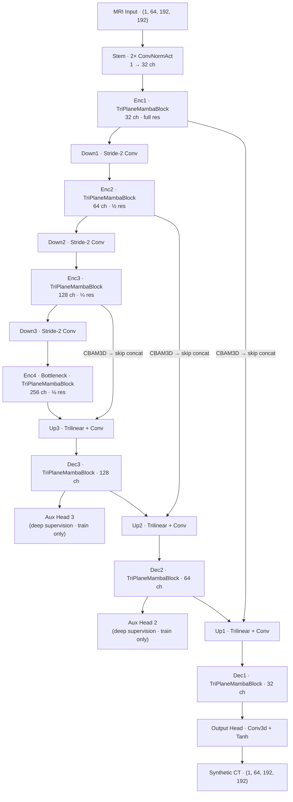
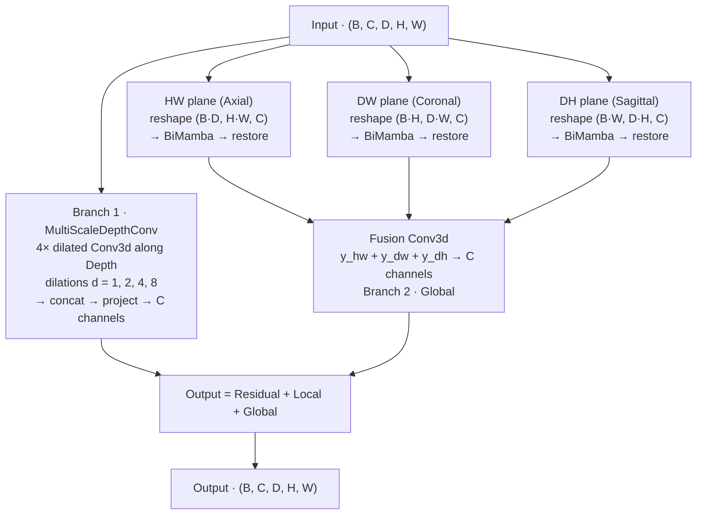
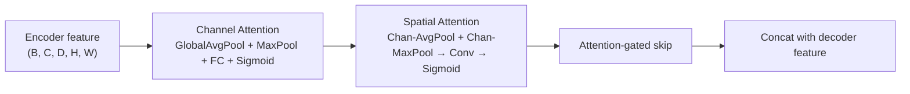
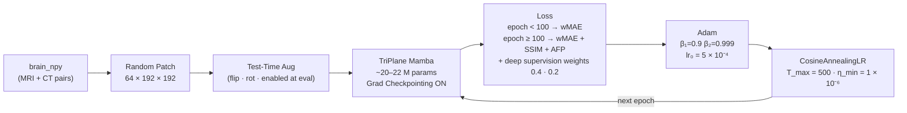
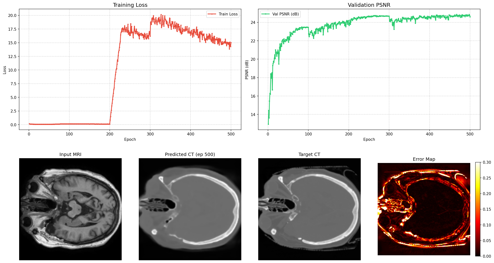

# TriPlane Mamba (TriPlaneMamba-UNet) — MRI-to-CT Synthesis

TriPlane Mamba is the **best-performing architecture** in this repository. It replaces 1D axial SSM scans with **2D planar Mamba scans** across the Axial (HW), Coronal (DW), and Sagittal (DH) planes. A parallel `MultiScaleDepthConv` branch captures local structure at 4 dilation scales. Combined, this gives richer spatial context than either single-axis or full-volume scanning.

---

## Folder Structure

```
triplane_mamba/
├── README.md
├── Triplane_Mamba_Report.md           # Full technical report
├── models.py                          # TriPlaneMamba-UNet architecture
├── train.py                           # Training script
├── evaluate.py                        # Inference + MAE / PSNR / SSIM
├── evaluate_dosimetric.py             # RED / Gamma-index dosimetric analysis
├── dataset.py                         # Data loader
├── losses.py                          # Loss functions
├── visualize.py                       # Generates comparison PNGs
├── environment.yml                    # Conda environment spec
├── run_training_triplane.sh
├── resume_training_triplane.sh
├── run_eval_trimamba.sh
├── architecture.html                  # Interactive architecture diagram
│
├── checkpoints_triplane/
│   ├── triplane_best.pth
│   ├── triplane_epoch50.pth … triplane_epoch500.pth
│   └── visuals/                       # Per-epoch training dashboards
│
├── predictions_triplane/
│   ├── dosimetric_metrics.csv
│   └── brain_001.npy … brain_037.npy
│
└── results/
    └── dashboard_final.png            # Final epoch training dashboard
```

---

## End-to-End Architecture



### TriPlaneMambaBlock — dual-branch design



> **Why 2D planes instead of 1D axes?** A single HW-plane scan captures both spatial dimensions of a slice simultaneously. The three planes together cover the full 3D structure with no dimension left unattended — stronger context than 1D axis scans at comparable sequence length.

### CBAM3D on skip connections



---

## Training Pipeline



### Hyperparameters

| Parameter | Value |
|---|---|
| Optimizer | Adam (β₁=0.9, β₂=0.999) |
| Initial LR | 5 × 10⁻⁴ |
| LR schedule | Cosine annealing · T_max=500 · η_min=1×10⁻⁶ |
| Epochs | 500 |
| Batch size | 1 |
| Patch size | (64, 192, 192) D×H×W |
| Base channels | 32 → 64 → 128 → 256 |
| SSM state dim | 16 |
| Depth conv dilations | [1, 2, 4, 8] |
| Parameters | ~20–22 M |
| Gradient checkpointing | Enabled (~60% activation memory saved) |
| Deep supervision | Aux heads at Dec2 and Dec3 (weights 0.4, 0.2) |
| Test-Time Augmentation | Enabled at inference |
| Mixed precision | AMP (fp16) |
| Upsampling | Trilinear interpolation + Conv3d (no checkerboard) |
| Checkpoint save | Every 50 epochs + best val |

### Loss Schedule

| Phase | Epochs | Components |
|---|---|---|
| Warmup | 1 – 99 | wMAE (Bone 3.0 · Soft tissue 1.5 · Air 0.5) |
| Full | 100 – 500 | wMAE + SSIM + AFP + deep supervision terms |

---

## Environment Setup

```bash
conda env create -f environment.yml
conda activate triplane
```

Or manually:

```bash
conda create -n triplane python=3.10 -y
conda activate triplane
pip install torch torchvision --index-url https://download.pytorch.org/whl/cu118
pip install numpy scipy scikit-image monai
pip install causal-conv1d>=1.2.0 mamba-ssm
```

> If `mamba-ssm` fails (CUDA mismatch), code falls back to GRU-based SSM automatically.

---

## Running

```bash
bash run_training_triplane.sh

# Or directly:
python train.py \
    --data_dir /DATA/divyansh/mc_ddpm_data/brain_npy \
    --epochs 500 \
    --batch_size 1 \
    --lr 5e-4 \
    --base_ch 32 \
    --save_dir ./checkpoints_triplane
```

### Resume

```bash
bash resume_training_triplane.sh
```

### Evaluate

```bash
bash run_eval_trimamba.sh

# Or directly:
python evaluate.py \
    --data_dir /DATA/divyansh/mc_ddpm_data/brain_npy \
    --checkpoint ./checkpoints_triplane/triplane_best.pth \
    --save_preds

python evaluate_dosimetric.py \
    --pred_dir ./predictions_triplane \
    --output_csv ./predictions_triplane/dosimetric_metrics.csv
```

---

## Results

### Image Quality (37 test cases)

| Metric | Score | Std Dev |
|---|---|---|
| **MAE** | **0.0445** | ± 0.0074 |
| **RMSE** | **0.1041** | ± 0.0178 |
| **PSNR** | **25.79 dB** | ± 1.42 dB |
| **SSIM** | **0.8561** | ± 0.0358 |

TriPlane achieves the **highest SSIM (0.8561)** and **best overall PSNR** among all architectures tested.

### Dosimetric Metrics

| Metric | TriPlane | TriAxial | Best |
|---|---|---|---|
| PSNR (3D) | **25.79 dB** | 25.71 dB | TriPlane |
| PSNR (2D) | **26.40 dB** | 26.32 dB | TriPlane |
| PSNR (1D) | **33.77 dB** | 33.32 dB | TriPlane |
| SSIM | **0.8502** | 0.8483 | TriPlane |
| Air MAE | **57.36 HU** | 60.77 HU | TriPlane |
| Soft Tissue MAE | 38.87 HU | **38.31 HU** | TriAxial |
| Bone MAE | **189.39 HU** | 196.20 HU | TriPlane |
| RED MAE | **0.04837** | 0.05012 | TriPlane |
| Gamma (1% / 1mm) | **90.61%** | 88.71% | TriPlane ✓ |
| Gamma (2% / 2mm) | **99.14%** | 98.83% | TriPlane |

> TriPlane Mamba crosses the clinical **90% threshold for the strict 1%/1mm Gamma criterion** (90.61%), the only Mamba variant to do so.

---

## Sample Results

Final epoch training dashboard (Input MRI · Generated CT · Target CT · Error Map):



---

## Full Technical Report

See [Triplane_Mamba_Report.md](Triplane_Mamba_Report.md) for the complete architecture source code, training details, and methodology.
