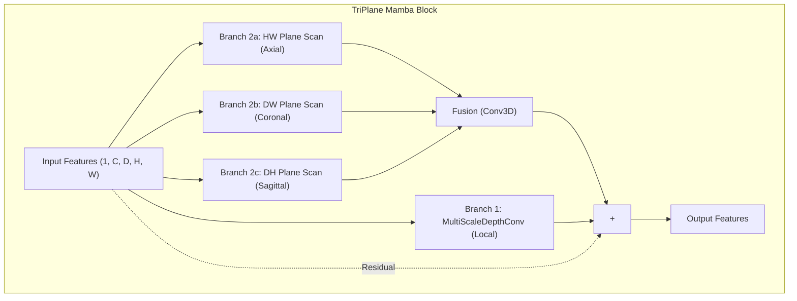

# Detailed Report: TriPlane Mamba (TriPlaneMamba-UNet)

This report details the implementation, methodology, and evaluation of the **TriPlane Mamba** architecture for 3D MRI-to-CT synthesis.

## 1. Project Overview

The TriPlane Mamba approach improves upon the TriAxial methodology by replacing 1D axial scans with 2D planar scans, ensuring a richer spatial context representation.

### Key Architectural Features:
1. **TriPlaneMambaBlock:** The core SSM block runs two parallel branches:
   - **Branch 1 (Local):** `MultiScaleDepthConv` — A multi-scale depth convolution utilizing 4 parallel 3D convolutions with varying dilation rates `[1, 2, 4, 8]` along the depth axis.
   - **Branch 2 (Global):** Tri-plane bidirectional Mamba scans the input across the Axial (`hw`), Coronal (`dw`), and Sagittal (`dh`) planes. 
2. **CBAM3D on Skip Connections:** Applies Channel and Spatial Attention to the encoder features before concatenating them in the decoder.
3. **Deep Supervision & Gradient Checkpointing:** Retained from the TriAxial approach for robust regularization and significant VRAM savings.
4. **Interpolate+Conv Upsampling:** Eliminates checkerboard upsampling artifacts.

---

## 2. Architecture Diagram

The inner mechanics of the **TriPlane Mamba Block** are illustrated below:



---

## 3. Parameters & Test Metrics

- **Model Parameters:** ~20-22 Million (slightly larger than TriMamba due to the multi-scale depth conv)
- **Base Channels:** 32 (Doubling at each encoder stage: 32 → 64 → 128 → 256)
- **SSM State Dimension (`d_state`):** 16
- **Test-Time Augmentation (TTA):** Enabled

### Test Set Performance
The model was evaluated using the best checkpoint (`triplane_best.pth`).

| Metric | Score | Std Dev |
| :--- | :--- | :--- |
| **MAE** *(Lower is better)* | **0.0445** | ± 0.0074 |
| **RMSE** *(Lower is better)* | **0.1041** | ± 0.0178 |
| **PSNR** *(Higher is better)* | **25.7928 dB** | ± 1.4222 |
| **SSIM** *(Higher is better)* | **0.8561** | ± 0.0358 |

*Note: The TriPlane approach yielded the highest overall performance out of the Mamba architectures tested, showing excellent structural retention (SSIM = 0.8561) by combining both planar SSM global modeling and dilated local convolutions.*

---

## 4. Complete Model Source Code

Below is the complete, self-contained implementation of TriPlaneMamba-UNet.

```python
import torch
import torch.nn as nn
import torch.nn.functional as F
from torch.utils.checkpoint import checkpoint as grad_checkpoint

try:
    from mamba_ssm import Mamba
    MAMBA_AVAILABLE = True
except ImportError:
    MAMBA_AVAILABLE = False
    print("[WARNING] mamba-ssm not installed. Using fallback GRU-based SSM.")

class FallbackSSMBlock(nn.Module):
    def __init__(self, d_model):
        super().__init__()
        self.norm = nn.LayerNorm(d_model)
        self.gru  = nn.GRU(d_model, d_model, batch_first=True, bidirectional=False)

    def forward(self, x):
        residual = x
        x = self.norm(x)
        x, _ = self.gru(x)
        return x + residual

def get_ssm_block(d_model, d_state=16, d_conv=4, expand=2):
    if MAMBA_AVAILABLE:
        return Mamba(d_model=d_model, d_state=d_state, d_conv=d_conv, expand=expand)
    else:
        return FallbackSSMBlock(d_model)

class ConvNormAct(nn.Module):
    def __init__(self, in_ch, out_ch, kernel=3, stride=1, padding=1):
        super().__init__()
        self.block = nn.Sequential(
            nn.Conv3d(in_ch, out_ch, kernel, stride=stride, padding=padding),
            nn.InstanceNorm3d(out_ch, affine=True),
            nn.LeakyReLU(0.2, inplace=True)
        )
    def forward(self, x):
        return self.block(x)

class ResConvBlock(nn.Module):
    def __init__(self, ch):
        super().__init__()
        self.block = nn.Sequential(ConvNormAct(ch, ch), ConvNormAct(ch, ch))
    def forward(self, x):
        return x + self.block(x)

class MultiScaleDepthConv(nn.Module):
    def __init__(self, channels):
        super().__init__()
        assert channels % 4 == 0, f"channels must be divisible by 4, got {channels}"
        mid = channels // 4

        self.reduce = nn.Sequential(
            nn.Conv3d(channels, channels, kernel_size=1, bias=False),
            nn.InstanceNorm3d(channels, affine=True),
            nn.LeakyReLU(0.2, inplace=True)
        )

        self.conv_d1 = nn.Conv3d(channels, mid, kernel_size=(3, 1, 1), padding=(1, 0, 0), dilation=(1, 1, 1), bias=False)
        self.conv_d2 = nn.Conv3d(channels, mid, kernel_size=(3, 1, 1), padding=(2, 0, 0), dilation=(2, 1, 1), bias=False)
        self.conv_d4 = nn.Conv3d(channels, mid, kernel_size=(3, 1, 1), padding=(4, 0, 0), dilation=(4, 1, 1), bias=False)
        self.conv_d8 = nn.Conv3d(channels, mid, kernel_size=(3, 1, 1), padding=(8, 0, 0), dilation=(8, 1, 1), bias=False)

        self.project = nn.Sequential(
            nn.Conv3d(channels, channels, kernel_size=1, bias=False),
            nn.InstanceNorm3d(channels, affine=True),
            nn.LeakyReLU(0.2, inplace=True)
        )

    def forward(self, x):
        x_r = self.reduce(x)
        f1   = self.conv_d1(x_r)
        f2   = self.conv_d2(x_r)
        f4   = self.conv_d4(x_r)
        f8   = self.conv_d8(x_r)
        out  = self.project(torch.cat([f1, f2, f4, f8], dim=1))
        del x_r, f1, f2, f4, f8
        return out

class TriPlaneMambaBlock(nn.Module):
    def __init__(self, channels, d_state=16):
        super().__init__()
        self.channels = channels
        self.ms_conv = MultiScaleDepthConv(channels)
        self.norm = nn.LayerNorm(channels)

        self.ssm_hw_fwd = get_ssm_block(d_model=channels, d_state=d_state)
        self.ssm_hw_bwd = get_ssm_block(d_model=channels, d_state=d_state)
        self.ssm_dw_fwd = get_ssm_block(d_model=channels, d_state=d_state)
        self.ssm_dw_bwd = get_ssm_block(d_model=channels, d_state=d_state)
        self.ssm_dh_fwd = get_ssm_block(d_model=channels, d_state=d_state)
        self.ssm_dh_bwd = get_ssm_block(d_model=channels, d_state=d_state)

        self.fusion = nn.Sequential(
            nn.Conv3d(channels, channels, kernel_size=1, bias=False),
            nn.InstanceNorm3d(channels, affine=True),
            nn.LeakyReLU(0.2, inplace=True)
        )

    def _bidir(self, ssm_fwd, ssm_bwd, x_seq):
        x_norm = self.norm(x_seq)
        y_fwd  = ssm_fwd(x_norm)
        y_bwd  = torch.flip(ssm_bwd(torch.flip(x_norm, dims=[1])), dims=[1])
        y = (y_fwd + y_bwd) * 0.5
        del x_norm, y_fwd, y_bwd
        return y

    def _scan_hw(self, x):
        B, C, D, H, W = x.shape
        x_seq = x.permute(0, 2, 3, 4, 1).reshape(B * D, H * W, C)
        y = self._bidir(self.ssm_hw_fwd, self.ssm_hw_bwd, x_seq)
        del x_seq
        return y.reshape(B, D, H, W, C).permute(0, 4, 1, 2, 3).contiguous()

    def _scan_dw(self, x):
        B, C, D, H, W = x.shape
        x_seq = x.permute(0, 3, 2, 4, 1).reshape(B * H, D * W, C)
        y = self._bidir(self.ssm_dw_fwd, self.ssm_dw_bwd, x_seq)
        del x_seq
        return (y.reshape(B, H, D, W, C).permute(0, 4, 2, 1, 3).contiguous())

    def _scan_dh(self, x):
        B, C, D, H, W = x.shape
        x_seq = x.permute(0, 4, 2, 3, 1).reshape(B * W, D * H, C)
        y = self._bidir(self.ssm_dh_fwd, self.ssm_dh_bwd, x_seq)
        del x_seq
        return (y.reshape(B, W, D, H, C).permute(0, 4, 2, 3, 1).contiguous())

    def forward(self, x):
        residual = x
        x_local = self.ms_conv(x)
        y_hw = self._scan_hw(x)
        y_dw = self._scan_dw(x)
        y_dh = self._scan_dh(x)
        y_global = self.fusion(y_hw + y_dw + y_dh)
        del y_hw, y_dw, y_dh
        return residual + x_local + y_global

class ChannelAttention3D(nn.Module):
    def __init__(self, channels, reduction=16):
        super().__init__()
        mid = max(channels // reduction, 8)
        self.mlp = nn.Sequential(
            nn.Linear(channels, mid, bias=False),
            nn.ReLU(inplace=True),
            nn.Linear(mid, channels, bias=False)
        )
    def forward(self, x):
        B, C, D, H, W = x.shape
        avg = x.mean(dim=(2, 3, 4))
        mx  = x.amax(dim=(2, 3, 4))
        att = torch.sigmoid(self.mlp(avg) + self.mlp(mx))
        return x * att.unsqueeze(-1).unsqueeze(-1).unsqueeze(-1)

class SpatialAttention3D(nn.Module):
    def __init__(self, kernel_size=7):
        super().__init__()
        self.conv = nn.Conv3d(2, 1, kernel_size, padding=kernel_size // 2, bias=False)
    def forward(self, x):
        avg = x.mean(dim=1, keepdim=True)
        mx  = x.amax(dim=1, keepdim=True)
        att = torch.sigmoid(self.conv(torch.cat([avg, mx], dim=1)))
        return x * att

class CBAM3D(nn.Module):
    def __init__(self, channels, reduction=16, spatial_kernel=7):
        super().__init__()
        self.ca = ChannelAttention3D(channels, reduction)
        self.sa = SpatialAttention3D(spatial_kernel)
    def forward(self, x):
        return self.sa(self.ca(x))

class TriPlaneEncoderBlock(nn.Module):
    def __init__(self, ch, d_state=16, use_checkpoint=True):
        super().__init__()
        self.conv  = ResConvBlock(ch)
        self.mamba = TriPlaneMambaBlock(ch, d_state=d_state)
        self.norm  = nn.InstanceNorm3d(ch, affine=True)
        self.use_checkpoint = use_checkpoint

    def _forward_mamba(self, x):
        return self.mamba(x)

    def forward(self, x):
        x = self.conv(x)
        if self.use_checkpoint and self.training:
            x = grad_checkpoint(self._forward_mamba, x, use_reentrant=False)
        else:
            x = self.mamba(x)
        return self.norm(x)

class TriPlaneMambaUNet(nn.Module):
    def __init__(self, in_ch=1, out_ch=1, base_ch=32, d_state=16,
                 deep_supervision=True, use_checkpoint=True):
        super().__init__()
        self.deep_supervision = deep_supervision
        c1, c2, c3, c4 = base_ch, base_ch*2, base_ch*4, base_ch*8

        self.stem = nn.Sequential(ConvNormAct(in_ch, c1), ConvNormAct(c1, c1))

        self.enc1  = TriPlaneEncoderBlock(c1, d_state=d_state, use_checkpoint=use_checkpoint)
        self.down1 = ConvNormAct(c1, c2, stride=2)
        self.enc2  = TriPlaneEncoderBlock(c2, d_state=d_state, use_checkpoint=use_checkpoint)
        self.down2 = ConvNormAct(c2, c3, stride=2)
        self.enc3  = TriPlaneEncoderBlock(c3, d_state=d_state, use_checkpoint=use_checkpoint)
        self.down3 = ConvNormAct(c3, c4, stride=2)
        self.enc4  = TriPlaneEncoderBlock(c4, d_state=d_state, use_checkpoint=use_checkpoint)

        self.up3_conv = nn.Sequential(nn.Conv3d(c4, c3, kernel_size=1), nn.InstanceNorm3d(c3, affine=True), nn.LeakyReLU(0.2, inplace=True))
        self.cbam3 = CBAM3D(c3)
        self.dec3  = TriPlaneEncoderBlock(c3 * 2, d_state=d_state, use_checkpoint=use_checkpoint)
        self.proj3 = ConvNormAct(c3 * 2, c3)

        self.up2_conv = nn.Sequential(nn.Conv3d(c3, c2, kernel_size=1), nn.InstanceNorm3d(c2, affine=True), nn.LeakyReLU(0.2, inplace=True))
        self.cbam2 = CBAM3D(c2)
        self.dec2  = TriPlaneEncoderBlock(c2 * 2, d_state=d_state, use_checkpoint=use_checkpoint)
        self.proj2 = ConvNormAct(c2 * 2, c2)

        self.up1_conv = nn.Sequential(nn.Conv3d(c2, c1, kernel_size=1), nn.InstanceNorm3d(c1, affine=True), nn.LeakyReLU(0.2, inplace=True))
        self.cbam1 = CBAM3D(c1)
        self.dec1  = TriPlaneEncoderBlock(c1 * 2, d_state=d_state, use_checkpoint=use_checkpoint)
        self.proj1 = ConvNormAct(c1 * 2, c1)

        self.head = nn.Sequential(nn.Conv3d(c1, out_ch, 1), nn.Tanh())

        if deep_supervision:
            self.aux_head_d2 = nn.Sequential(nn.Conv3d(c2, out_ch, 1), nn.Tanh())
            self.aux_head_d3 = nn.Sequential(nn.Conv3d(c3, out_ch, 1), nn.Tanh())

    def _upsample_like(self, x, target):
        return F.interpolate(x, size=target.shape[2:], mode='trilinear', align_corners=False)

    def forward(self, x):
        x0 = self.stem(x)
        e1 = self.enc1(x0)
        e2 = self.enc2(self.down1(e1))
        e3 = self.enc3(self.down2(e2))
        e4 = self.enc4(self.down3(e3))

        up3 = self.up3_conv(self._upsample_like(e4, e3))
        d3  = self.proj3(self.dec3(torch.cat([up3, self.cbam3(e3)], dim=1)))
        del e4, up3

        up2 = self.up2_conv(self._upsample_like(d3, e2))
        d2  = self.proj2(self.dec2(torch.cat([up2, self.cbam2(e2)], dim=1)))
        del e3, up2

        up1 = self.up1_conv(self._upsample_like(d2, e1))
        d1  = self.proj1(self.dec1(torch.cat([up1, self.cbam1(e1)], dim=1)))
        del e2, up1

        out = self.head(d1)

        if self.deep_supervision and self.training:
            aux2 = self.aux_head_d2(d2)
            aux3 = self.aux_head_d3(d3)
            return out, aux2, aux3

        return out
```
