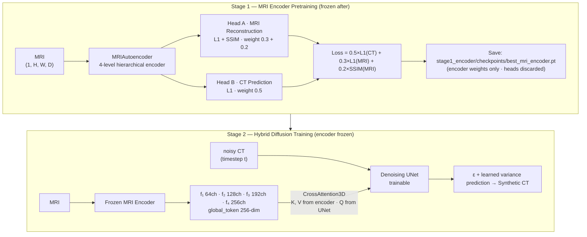
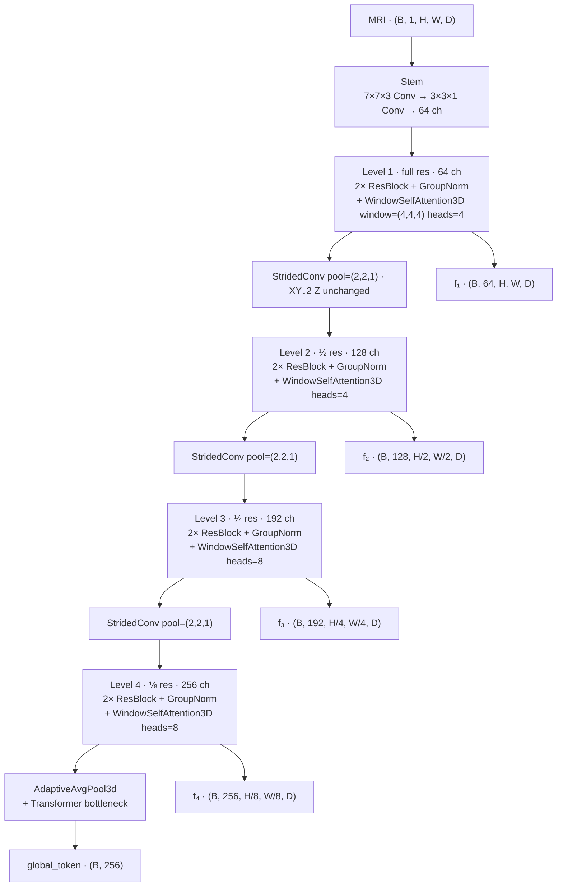
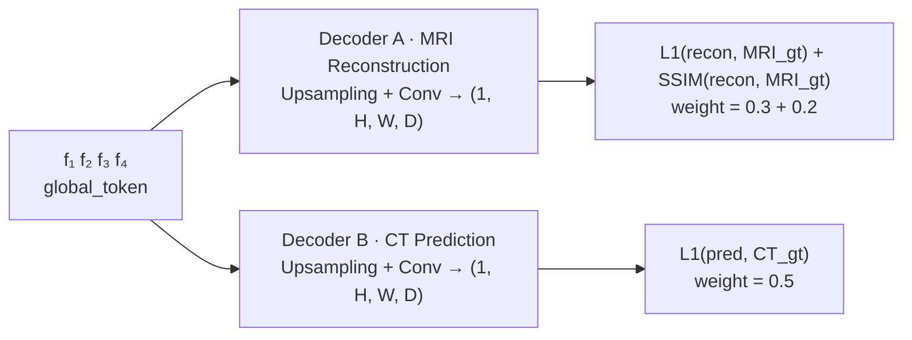
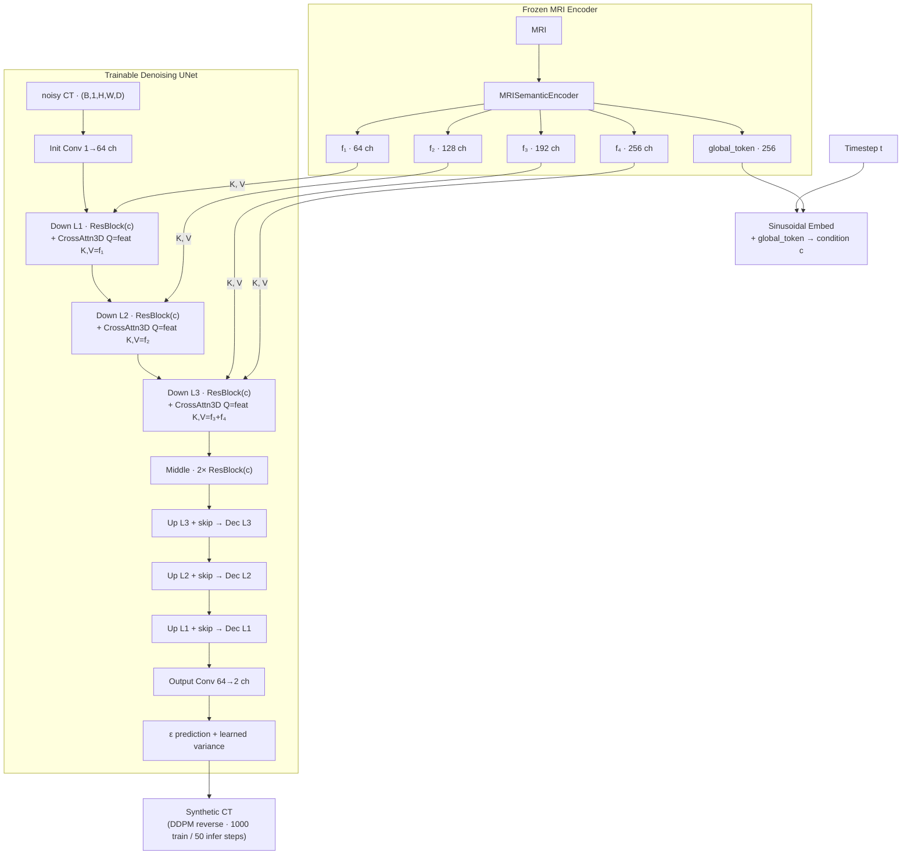
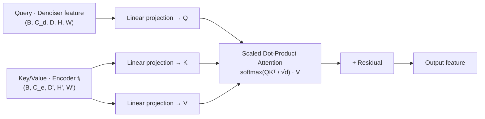
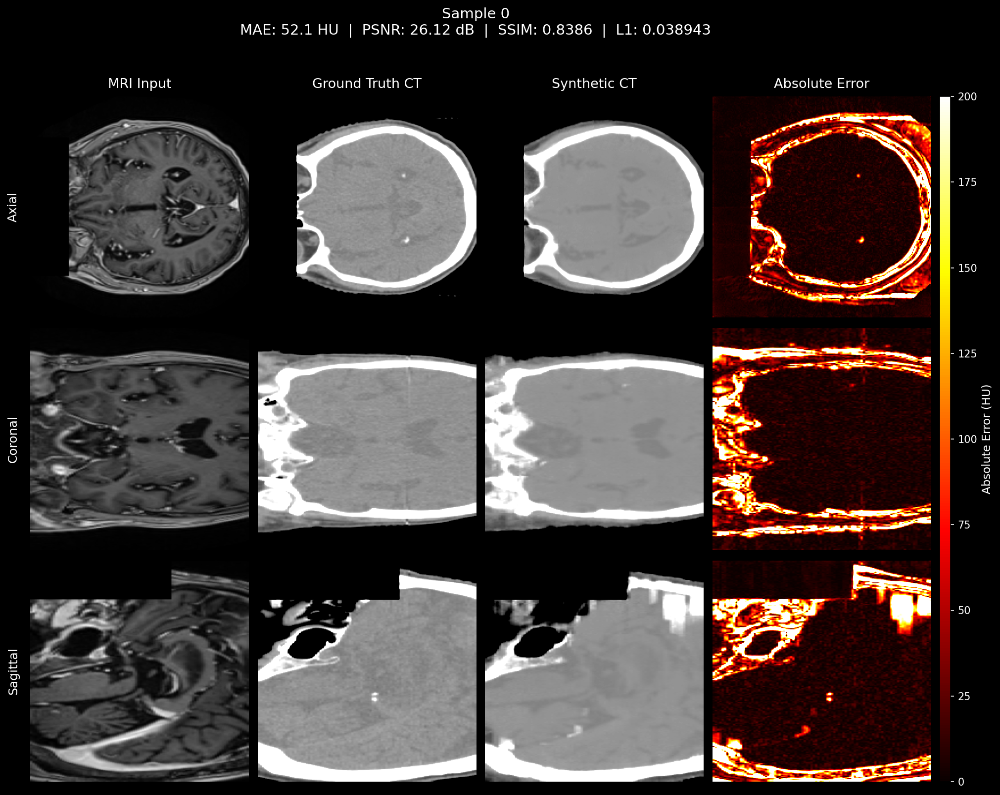
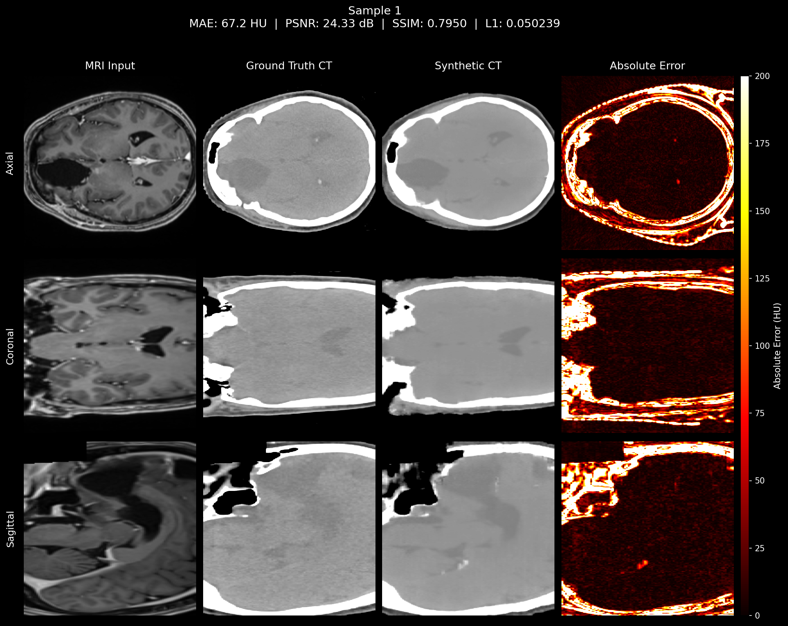
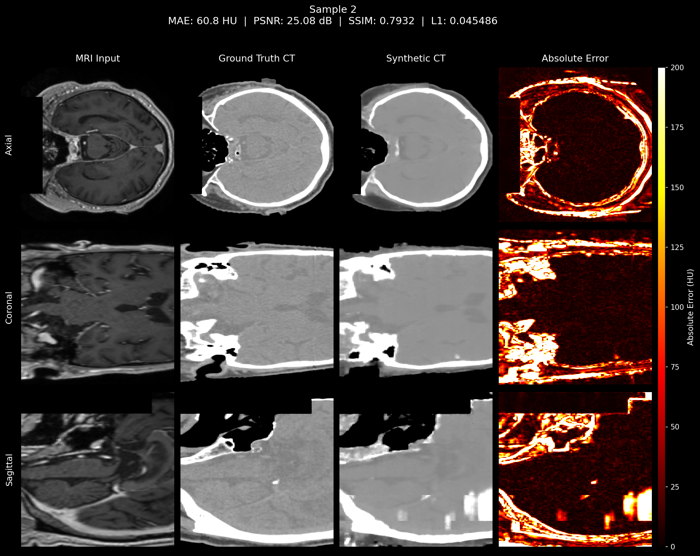
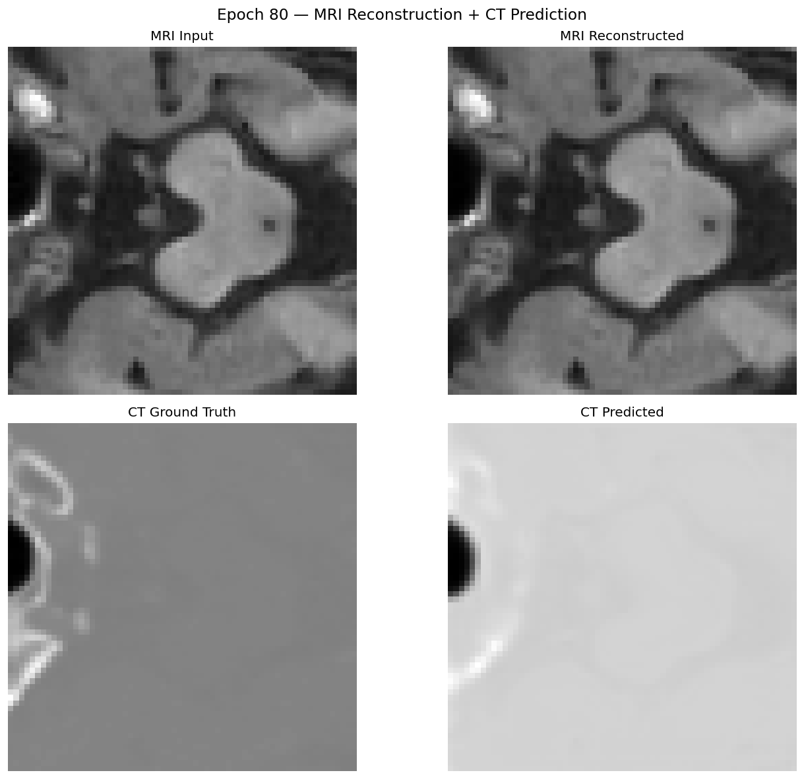

# Pretrained MRI Encoder + Diffusion Model — MRI-to-CT Synthesis

A **two-stage pipeline** for MRI → Synthetic CT generation. The core contribution is a **task-aware MRI semantic encoder** pretrained to extract CT-discriminative MRI features, which then conditions a 3D diffusion denoising model via cross-attention.

---

## Motivation

In the original MC-IDDPM pipeline, the MRI is concatenated directly to the noisy CT input as a 2-channel tensor. This requires the denoising network itself to learn MRI-to-CT semantics while also learning the diffusion denoising task — two objectives competing inside a single model.

**This project separates those concerns:**

| | Original MC-IDDPM | This approach |
|---|---|---|
| MRI role | Concatenated to noisy CT input | Encoded into rich semantic features |
| MRI feature learning | Inside the denoiser (implicit) | **Dedicated pretrained encoder (explicit)** |
| Denoiser input | `[noisy_CT ‖ MRI]` 2-channel | `noisy_CT` + cross-attention from encoder |
| Stage count | 1 | 2 |

---

## Pipeline Overview



---

## Folder Structure

```
pretrained_encoder_diffusion/
├── README.md
├── environment.yml / environment_linux.yml
├── LICENSE
│
├── network/                           # Model architectures
│   ├── mri_encoder.py                 # MRIAutoencoder + MRISemanticEncoder
│   ├── hybrid_model.py                # HybridDiffusionModel (encoder + denoiser)
│   ├── cross_attention.py             # CrossAttention3D
│   ├── Diffusion_model_transformer.py # SwinViT-based denoising network
│   ├── Diffusion_model_Unet.py        # UNet-based denoising network
│   └── util_network.py               # Shared utilities
│
├── diffusion/                         # Diffusion process
│   ├── GaussianDiffusion.py
│   ├── HybridGaussianDiffusion.py
│   ├── HybridSpacedDiffusion.py
│   └── respace.py / resampler.py
│
├── stage1_encoder/                    # Stage 1: MRI encoder pretraining
│   ├── pretrain_mri_encoder.py
│   ├── eval_mri_encoder.py
│   ├── run_pretrain.sh
│   ├── checkpoints/best_mri_encoder.pt
│   ├── visualizations/               # Per-epoch: MRI in/recon + CT gt/pred
│   └── eval_results/                 # Encoder evaluation outputs
│
├── stage2_diffusion/                  # Stage 2: Hybrid diffusion
│   ├── main_hybrid.py
│   ├── inference_hybrid.py
│   ├── run_training_hybrid.sh
│   ├── run_inference_hybrid.sh
│   ├── checkpoints/best_model.pt
│   ├── results/brain_hybrid/         # Training-time visualizations
│   └── inference_results/hybrid/
│       ├── metrics.txt
│       └── vis/sample_000.png … sample_036.png
│
├── baseline/                          # Original MC-IDDPM (no encoder)
└── scripts/                           # Preprocessing + evaluation utilities
```

---

## Stage 1 — MRI Semantic Encoder

### Architecture



### Pretraining dual heads (discarded after Stage 1)



### Stage 1 Hyperparameters

| Parameter | Value |
|---|---|
| Optimizer | Adam (β₁=0.9, β₂=0.999) |
| Initial LR | 1 × 10⁻⁴ |
| LR schedule | CosineAnnealingLR · T_max=500 · η_min=1×10⁻⁷ |
| Epochs | 500 (early stopping patience=80) |
| Batch size | 4 |
| Patch size | (64, 64, 4) |
| Encoder channels | 64 → 128 → 192 → 256 |
| SA window size | (4, 4, 4) |
| SA heads per level | (4, 4, 8, 8) |
| Pooling kernel | (2, 2, 1) — XY↓2, Z unchanged |
| Mixed precision | AMP (fp16) with SSIM cast to float32 |
| Loss weights | CT: 0.5 · MRI recon L1: 0.3 · MRI recon SSIM: 0.2 |

> **LR = 1e-4, not 3e-4:** 3×10⁻⁴ caused fp16 NaN in SSIM Gaussian convolution. SSIM is explicitly cast to float32 under AMP to prevent silent overflow.

---

## Stage 2 — Hybrid Diffusion Model

### Architecture



### CrossAttention3D



### Stage 2 Hyperparameters

| Parameter | Value |
|---|---|
| Optimizer | Adam (β₁=0.9, β₂=0.999) |
| Initial LR | 1 × 10⁻⁴ |
| LR schedule | CosineAnnealingLR · T_max=500 · η_min=1×10⁻⁷ |
| Diffusion steps (train) | 1000 |
| Diffusion steps (infer) | 50 (spaced / DDIM-style) |
| Loss | Hybrid ELBO (ε-prediction + learned variance) |
| Encoder | Frozen (Stage 1 weights loaded) |
| Patch size | (64, 64, 4) |
| Batch size | 4 |
| Mixed precision | AMP (fp16) |

---

## Running

### Step 1 — Pretrain the MRI Encoder

```bash
cd stage1_encoder
bash run_pretrain.sh
# Or: python pretrain_mri_encoder.py
```

Monitor:
```bash
tensorboard --logdir stage1_encoder/tensorboard_logs --port 6007
```

Output: `stage1_encoder/checkpoints/best_mri_encoder.pt`

### Step 2 — Train Hybrid Diffusion

```bash
cd stage2_diffusion
bash run_training_hybrid.sh
# Or: python main_hybrid.py
```

`main_hybrid.py` auto-loads `../stage1_encoder/checkpoints/best_mri_encoder.pt` and freezes it.

### Step 3 — Run Inference

```bash
cd stage2_diffusion
bash run_inference_hybrid.sh
# Or: python inference_hybrid.py
```

Results → `stage2_diffusion/inference_results/hybrid/`

---

## Results

### Stage 2 Test-Set Performance (37 brain cases)

| Metric | Score | Std Dev |
|---|---|---|
| L1 | 0.0492 | ± 0.0077 |
| PSNR | 24.12 dB | ± 1.14 dB |
| SSIM | 0.8037 | ± 0.0334 |
| MAE (HU) | 65.8 HU | ± 10.3 HU |

Full breakdown: [`stage2_diffusion/inference_results/hybrid/metrics.txt`](stage2_diffusion/inference_results/hybrid/metrics.txt)

### Comparison with Mamba Approaches

| Metric | Hybrid Encoder-Diffusion | Best Mamba (TriPlane) |
|---|---|---|
| PSNR | 24.12 dB | **25.79 dB** |
| SSIM | 0.8037 | **0.8561** |
| MAE | 0.0492 | **0.0445** |

---

## Sample Inference Results

Best inference case (Sample 0 — PSNR 26.12 dB, SSIM 0.8386):







> All 37 samples: [`stage2_diffusion/inference_results/hybrid/vis/`](stage2_diffusion/inference_results/hybrid/vis/)

### Stage 1 Encoder Pretraining Progression

Each image: MRI input · MRI reconstructed · CT ground-truth · CT predicted





> All epoch visualizations: [`stage1_encoder/visualizations/`](stage1_encoder/visualizations/)

---

## Key Design Decisions

| Decision | Reason |
|---|---|
| Dual-task pretraining | CT prediction forces HU-discriminative features; MRI recon forces spatial fidelity |
| CT loss weight = 0.5 (highest) | Primary pretraining goal is CT-relevant MRI representation |
| Encoder frozen in Stage 2 | Prevents catastrophic forgetting of pretrained semantics |
| Cross-attention (not concat) | Denoiser selectively attends to relevant encoder features per scale |
| GroupNorm in encoder | Stable at batch size 2–4; BatchNorm unstable at small batches |
| LR = 1e-4 not 3e-4 | 3e-4 caused fp16 SSIM Gaussian conv overflow → NaN in early runs |
| SSIM in float32 under AMP | fp16 Gaussian conv overflows silently; explicit cast prevents NaN |
| Pooling kernel (2,2,1) | XY downsampling preserves Z-axis resolution for thin-slice brain data |

---

## Reference

Original MC-IDDPM paper: [Synthetic CT generation from MRI using 3D transformer-based denoising diffusion model](https://aapm.onlinelibrary.wiley.com/doi/abs/10.1002/mp.16847) — Shaoyan Pan et al., *Medical Physics* 2023.

Built on: [guided-diffusion](https://github.com/openai/guided-diffusion) · SwinUnet · MONAI
